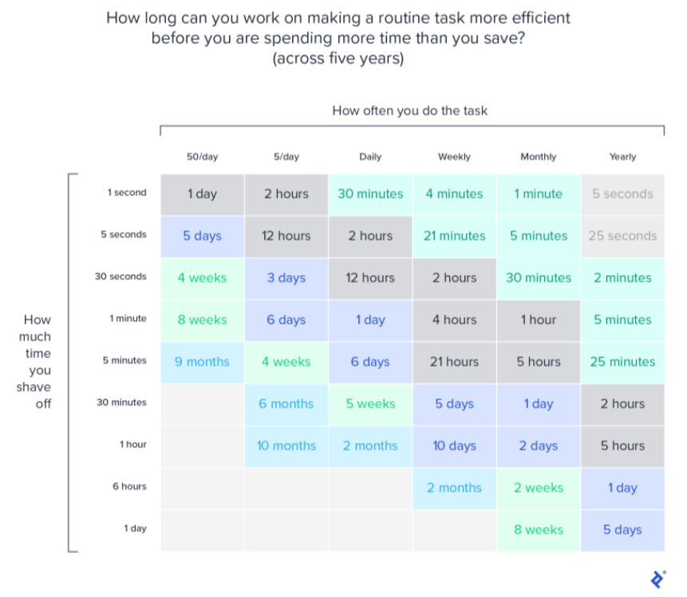

Quanto tempo você pode gastar tornando uma tarefa rotineira mais eficiente antes de estar gastando mais tempo do que economiza? (considerando cinco anos)

| Economia por vez | 50×/dia | 5×/dia | Diário | Semanal | Mensal | Anual |
|---|---|---|---|---|---|---|
| 1 segundo | 1 dia | 2 horas | 30 min | 4 min | 1 min | 5 seg |
| 5 segundos | 5 dias | 12 horas | 2 horas | 21 min | 5 min | 25 seg |
| 30 segundos | 4 semanas | 3 dias | 12 horas | 2 horas | 30 min | 2 min |
| 1 minuto | 8 semanas | 6 dias | 1 dia | 4 horas | 1 hora | 5 min |
| 5 minutos | 9 meses | 4 semanas | 6 dias | 21 horas | 5 horas | 25 min |
| 30 minutos | — | 6 meses | 5 semanas | 5 dias | 1 dia | 2 horas |
| 1 hora | — | 10 meses | 2 meses | 10 dias | 2 dias | 5 horas |
| 6 horas | — | — | — | 2 meses | 2 semanas | 1 dia |
| 1 dia | — | — | — | — | 8 semanas | 5 dias |

Baseado em [xkcd #1205 — Is It Worth the Time?](https://xkcd.com/1205/) de Randall Munroe.
