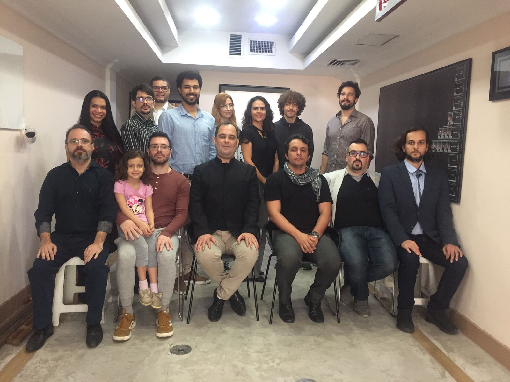

Num Open House no centro de transmissão de Ipanema, na abertura do Sam Toi, Si Fu falava como, apesar de nossa prática não ser religiosa, certos ensinamentos do budismo acabam fazendo parte do nosso dia-a-dia.

Dado o momento, comentava sobre os 3 registros ou marcas da existência do Budismo:

1. **Insubstancialidade:** As coisas não têm uma substância nelas próprias. Si Fu citou o paradoxo do barco de Teseu: "se trocarmos todas as peças do barco de Teseu, uma a uma, o barco deixa de ser dele? Se montarmos um outro barco ao lado com as peças trocadas, temos dois barcos de Teseu?"
2. **Sofrimento:** Você irá sofrer. Não importa o que faça, a condição humana é de sofrimento. Estamos no caminho do aperfeiçoamento, o caminho do Kung Fu, não há como escapar dessa verdade.
3. **Impermanência:** Nada é permanente, tudo está em constante mudança. O exemplo que ele usou foi do morro Dois Irmãos em Ipanema: não é porque ele está lá agora, estava lá há 200 anos, estará daqui a 100 anos que ele é permanente. Na verdade, considerando a história da Terra ele está lá por apenas uma pequena fração de tempo.

Normalmente a disposição dessas verdades é invertida; Si Fu deslocou a impermanência para poder falar das diversas mudanças simultâneas que estávamos passando.

Uma das primeiras leituras que aprendi para o Ving Tsun ([永春](https://www.mdbg.net/chinese/dictionary?page=worddict&wdrst=0&wdqb=%E6%B0%B8%E6%98%A5)) seria: "Celebrar a Mudança". Está no nosso "DNA", no nosso [Kung Fu 功夫](../etimologia-do-termo-kung-fu/). Tudo irá mudar e uma das habilidades que mais treinamos é como lidar com isso.

> *"Não há mal que sempre dure, nem bem que nunca se acabe"*
>
> ~ Minha avó, mas certamente alguém falou antes dela
