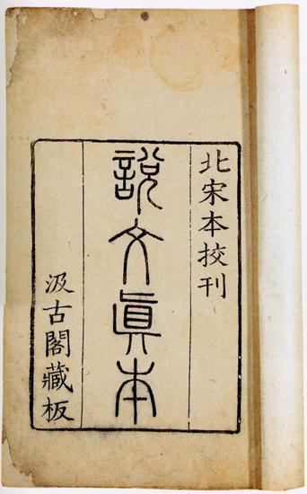
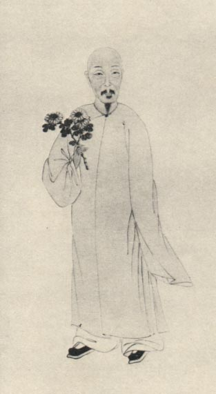
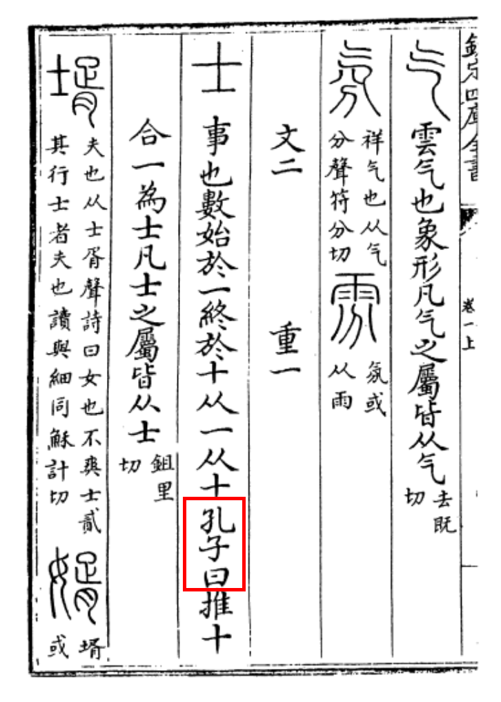
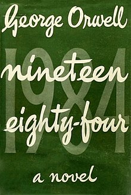

Por iniciativa do [Claudio Teixeira (Moy Kat Jo)](https://scholion.thluiz.com/notes/moy-kat-jo/) iniciamos os encontros regulares sobre o estudo de Cantonês instrumental com o [Si Fu 師父](https://scholion.thluiz.com/notes/os-dois-si-fu/). Acabamos ampliando o escopo para abordar também o Mandarim, de forma que um nome mais apropriado tem sido Chinês instrumental.

Em um dos encontros falamos sobre a etimologia de 尋 de [Cham Kiu 尋橋](https://scholion.thluiz.com/tags/cham-kiu/). [Si Fu 師父](https://scholion.thluiz.com/notes/os-dois-si-fu/) nos passou algumas possibilidades de leitura, mas eu estava um pouco incomodado pois nenhuma das opções parecia suficiente.

Fui me aprofundar mais e encontrei uma universidade curiosa que adotou o nome ocidental de Academia Sinica, a 中央研究院.

Eu já dei um sorrisinho 😏 ao lembrar de Si Taai Gung Moy Yat. Si Fu comenta que ele gostava muito desse jogo de palavras tanto em chinês quanto em inglês. Sinico x Cinico seria uma piada fonética que ele faria.

Para colocar mais um nível nessa piada, o nome em chinês é estranho: 中 significa centro (físico) e 央 pode ser traduzido como central. Os ideogramas finais (研究院) se referem a um instituto de pesquisa. Então uma leitura jocosa pode ser: _"Centro central de Pesquisa"_.

Para descer mais um nível na piada: O Centro Central de Pesquisa não fica na China. Fundado pelo governo nacionalista (國民黨, Kuomintang) em 1928, acabou indo para Taiwan [em 1949](https://en.wikipedia.org/wiki/Academia_Sinica).

Para nossa sorte, talvez para se afirmar culturalmente, Taiwan não costuma usar o dito chinês simplificado, recorrendo sempre à escrita tradicional. Para comprovar que está escrevendo o chinês correto, disponibilizou online toda a base do 說文解字注 (Shuōwén Jiězì Zhù).

### O Shuōwén Jiězì (說文解字)

Entre o primeiro e o segundo século da era comum (comum para quem?), 許慎 (Xǔ Shèn) compilou os principais ideogramas conhecidos com explicações e apresentou ao imperador da dinastia Han Oriental 東漢 (Dōng Hàn).

O nome indica o método que ele usara: explicar os padrões simples (文), decompor os compostos (字). 文 são os caracteres indivisíveis, os átomos gráficos. 字 são os que nascem da combinação.

O resultado seriam 9353 entradas, agrupadas por 540 radicais.

Acontece que estudar a origem das palavras, seja por radicais, história, antropologia ou arqueologia, é o que chamamos no ocidente de etimologia.

Sim. No século I os chineses já tinham essa preocupação, enquanto no ocidente as principais línguas só seriam fundadas quase 13 a 15 séculos depois: Dante só teria coragem de usar o Toscano-Florentino no século XIII, o Português, Francês, Espanhol e mesmo o inglês somente seriam estruturados entre os séculos XV e XVIII (['Fundações' das línguas modernas](https://scholion.thluiz.com/notes/fundacoes-das-linguas-modernas/)).

A motivação desse esforço etimológico foi a queima dos livros proporcionada pela dinastia Qin (221–206 a.C.). Livros confucianos se perderam e o sistema de escrita também mudou. Os estudiosos Han encontraram três barreiras: caracteres com formas diferentes, palavras que soavam diferente, significados que tinham mudado. Três problemas, três disciplinas ([說文解字](https://scholion.thluiz.com/notes/shuowen-jiezi/)):

- **小學** (xiǎoxué): Filologia. Aprender os fundamentos antes dos clássicos (大學)
- **文字學** (wénzìxué): O estudo dos caracteres divididos em 6 categorias.
- **聲韻學** (shēngyùnxué): A fonética a partir dos livros de rimas, cerca de 193 grupos fonéticos (que são infernais para entender, um dia chego lá)
- **訓詁學** (xùngǔxué): semântica e exegese. Quando um caractere muda de significado com o tempo. Por exemplo: 去 (qù), que significava "partir de", virou "ir para". Imagina ler um livro onde algumas palavras têm o significado oposto? _(no Francês às vezes 'avant' quer dizer "antes de", no sentido de quem está à frente 🤷)_

_O leitor mais atento irá notar que eles chamam de 3 disciplinas, mas na verdade são 4. A última talvez seja mais uma lista de curiosidades, ou os fonemas eram agrupados com os radicais. De toda forma, os chineses tendem a evitar o número 4 [四 e a tetraphobia](https://scholion.thluiz.com/notes/si-numero-quatro/)_

### E o que é o Zhù 注 em 說文解字注

Séculos se passam, múltiplas guerras, dinastias vêm e vão, livros queimados aqui e acolá; durante a dinastia Qīng 清 essa preocupação ressurge: [段玉裁 (Duàn Yùcái, 1735–1815)](https://scholion.thluiz.com/notes/duan-yucai-shuowen-jiezi-zhu/), discípulo de 戴震 (Dài Zhèn), compilaria o maior trabalho filológico já realizado, recompilar o 說文解字.

O problema que enfrentou: entre o original de Xǔ Shèn (ano 100) e as edições Sòng 宋 disponíveis (ano 986), havia quase novecentos anos de cópias manuscritas. Cada copista introduziu erros, interpolações, omissões. O texto que chegou ao século XVIII não era exatamente o que Xǔ Shèn escreveu.

O método de Duàn Yùcái foi comparar sistematicamente as edições existentes (大徐本 de Xú Xuān, 小徐本 de Xú Kǎi), cruzar com citações do Shuowen em outros textos antigos, e usar a fonologia e a lógica interna do dicionário para identificar corrupções. Onde o texto não fazia sentido fonológico ou semântico, ele propunha emendas e justificava cada uma.

O texto chegou intacto aos dias de hoje. A primeira edição impressa saiu em 1815 (經韻樓刻本, blocos de madeira), no ano da morte dele. Partes do manuscrito autógrafo sobrevivem na Biblioteca de Shanghai (上海圖書館). A edição padrão moderna é da 中華書局 (Zhōnghuá Shūjú). Está disponível digitalmente no ctext.org e no Scripta Sinica da Academia Sinica.

Quem estuda etimologia chinesa hoje consulta o Shuowen *através* do comentário de Duàn Yùcái.

### O que 2000 anos de fofoca podem fazer?

Eu fiquei bem empolgado por encontrar uma fonte fidedigna. Após 200 anos de sua edição o trabalho de Duàn segue sendo referenciado, revisado e refinado. De forma que se não era verdade, a maior parte das pessoas não há de discordar.

Fui pesquisar os ideogramas do meu nome Kung Fu [梅知友士 Moy Chi Yau Si](https://scholion.thluiz.com/notes/moy-chi-yau-si/), e no verbete para o 士 notei o "孔子曰：", ou seja, "Confúcio disse"? como assim?

**孔子曰：「推十合一為士。」** - Confúcio disse: quem reduz dez a um é um shì

Si Fu sempre salienta que quando alguém diz que alguém disse algo devemos tomar um cuidado redobrado. Confúcio data do século V antes da era comum, ou seja, eu estava impressionado de no século 1 existir preocupação etimológica, quer dizer que 600 anos antes Confúcio já tinha preocupação com isso?

Fui pesquisar e nada encontrei. Existem 'n' outros verbetes atribuídos. Se são de conhecimento comum ou argumentos de autoridade não há como saber.

Porém dois mil anos de cadeia ininterrupta atribuindo a mesma frase ao mesmo autor. Mesmo que Confúcio nunca tenha dito 推十合一為士, a essa altura já não importa. A atribuição *é* o fato histórico.

Vinte séculos de consenso criaram uma verdade funcional que nenhuma verificação pode desfazer, porque não existe registro anterior que a contradiga.

Por que será que estavam tão preocupados com etimologia tão cedo?

Uma questão dos nossos tempos é o quanto as palavras às vezes dizem pouco. Já chamei a atenção das minhas filhas por algumas brincadeiras "jovens": Elas trocavam algum jargão quase que invertendo o significado, parece inocente, mas também pode ser método. Um método bem antigo e perigoso.

De toda forma, tenho muito orgulho do 士 que o Si Fu me nomeou já ter sido definido por Confúcio 😜

_"Quem controla o presente, controla o passado, quem controla o passado controla o futuro"_ — George Orwell, *1984* (Part 1, Ch. 3)

---

*T L Si - Thiago Silva* 
*Moy Chi Yau Si* 
*梅 知 友 士*

