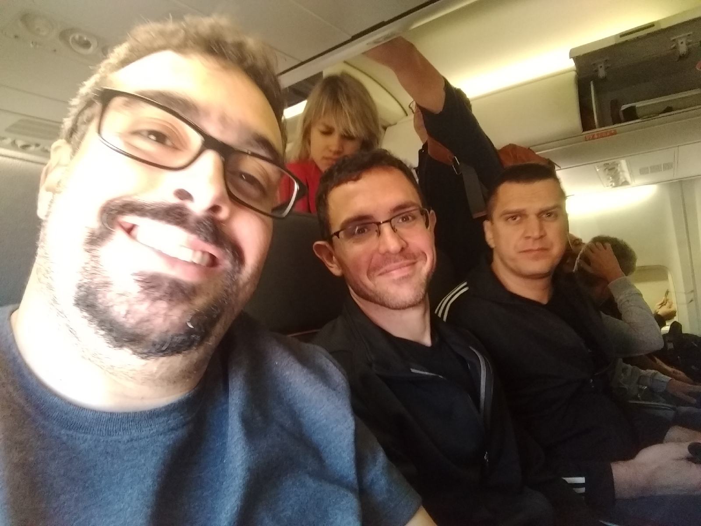

Tivemos um voo bem tranquilo pra a Argentina onde pude conversar muito com o Carlos Antunes, somos amigos de longa data, entretanto na correria do dia-a-dia fazia muito tempo que não ficávamos divagando entre assuntos como fazíamos antigamente. Ficamos um bom tempo na fila da imigração conversando com o Si Hing Fauzi sobre Zup e os lugares pelo mundo que ele visitou por conta da dança.

Já na saída o primeiro desafio, chegar no hotel no melhor custo benefício. Após idas e vindas nas negociações o valor estava entre 160 e 240 reais para conseguir os dois carros para a comitiva. Então Antunes conseguiu fechar o carro dele, Cláudio e Carmen por cerca de 80 reais, confirmando o menor preço de 80/carro. Bastava confirmar o Uber meu, do Si Hing Leo e Si Hing Fauzi quando nosso motorista, não sei se propositalmente, digitou que ele ia fazer pelo preço de 89 reais, bastava cancelar a corrida e pagar para ele em dinheiro. Não sabendo as regras do local, estava supondo que a manobra poderia ser comum, mas o que chamou atenção foi o preço com erro de digitação: "Não era 80?", o motorista tergiversou, tentei usar o erro à nosso favor e "como eu cancelei, pedi novamente e agora o Uber está cobrando 60". Percebendo que não íamos seguir com ele o motorista se despediu rispidamente para já poder pegar outra corrida.

Si Fu comenta que precisamos estar em guarda o tempo todo, mas sem neurose, você tem que estar relaxado para poder responder adequadamente ao que está acontecendo ao seu redor. Nosso próximo motorista seria Marcelo Martins, o maior portenho do mundo, que além de mais barato que o anterior se tornou o motorista oficial para longas distâncias. Fui fazendo várias perguntas sem muita relação aparente, apenas instigando-o a falar durante os quase 50 minutos da viagem do aeroporto para o hotel. Dessa entrevista informal, além de economizar 20 Reais, ainda conseguimos o motorista para pegar o Si Fu a noite e para nossa volta no domingo.

Acho que esse "relaxamento em guarda" foi a marca desse dia de viagem. Andamos bastante pelos pontos turísticos, comemos pratos típicos e deliciosos porém o grupo inteiro respirava marcialidade. Em cada parada para tirar uma selfie, um monumento sempre surgia um comentário aqui outro ali sobre histórias da família Kung Fu.

No final do dia, repassando o nosso roteiro (já a essa altura mais furado que queijo suíço), notamos que não tínhamos parado para falar do diário de bordo. Acordamos o Claudio, titular dessa atividade, para nos explicar como deveríamos fazer. Com todos mais despertos, ainda fomos comer uma pizza, o que para mim foi ótimo, pois me manteria "acordado" para aguardar o Marcelo para buscar o Si Fu no aeroporto.

As aspas no "acordado" se devem ao fato de que enquanto os demais aproveitavam o fim do dia para comer a nossa pizza de 10 queijos (que nós criamos a partir de outras pizzas do cardápio) eu estava maquinando sobre o que eu faria se o Marcelo não comparecesse. Ainda na pizza fiz uns Man Sau nele para checar se estava certo, mas só poderia dar como certo quando já estivesse no aeroporto, resultado:

Ele chegou um pouco antes do previsto e fomos tranquilamente para buscar o Si Fu. Estava feliz com o desenrolar das situações do dia e ia pagar um Bigmac para ele em agradecimento pelos serviços e também aproveitar para comer um sorvete eu mesmo (também sou filho de deus :P), entretanto meu cartão bloqueou por conta do horário (2 da manhã a essa altura) e no fim ele é que acabou pagando o meu sorvete, ou seja, mais um "desconto" que o relaxamento me proporcionaria nesse dia.

---

*T L Si - Thiago Silva* 
*Moy Chi Yau Si* 
*梅 知 友 士*
