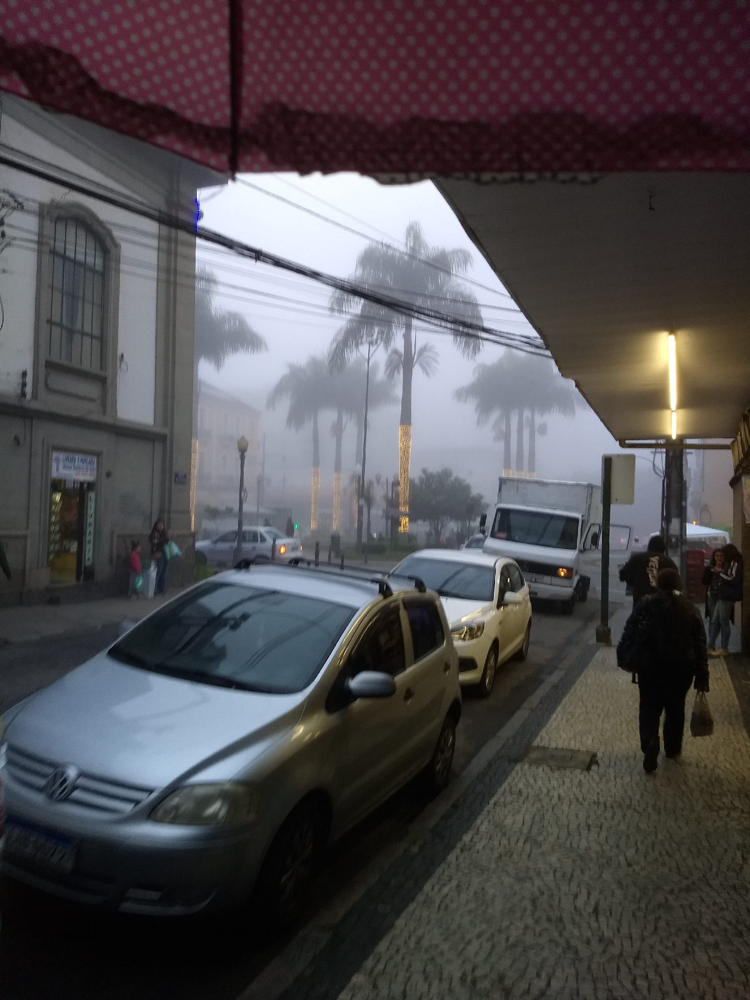
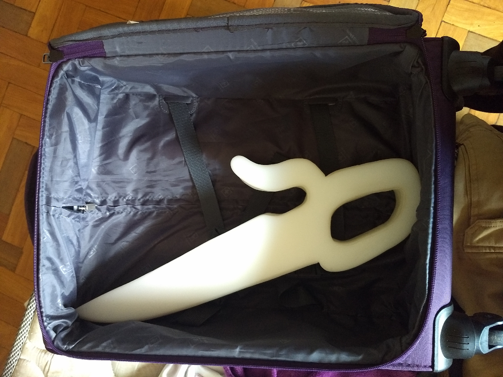
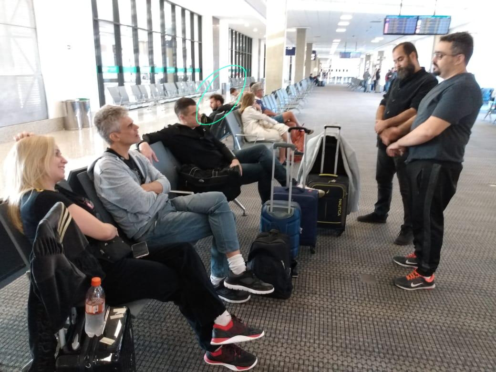
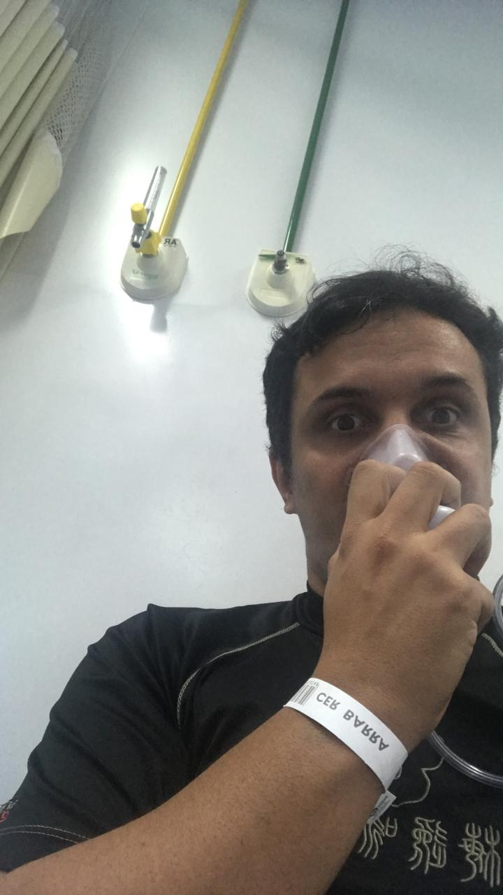

Si Fu sempre comenta que um diário precisa ser diário — apesar de parecer óbvio, o próprio nome desse tipo de registro indica que ele deve ser feito todos os dias. Entretanto, há duas formas mais fáceis de manter esse tipo de registro: ou postar apenas algumas fotos com pouca coisa a dizer, ou escrever longos e cansativos textos tanto para quem escreve quanto para quem lê.

Para encontrar o meio-termo entre as duas abordagens, vou me apoiar em dois textos anteriores: um sobre o longo dia do Si Hing Cláudio e outro sobre a sintonia da Carmen.

Outra observação comum do Si Fu é que é impossível apontar quando um evento realmente começa. Todo ponto de partida é arbitrário. Citando Carl Sagan: "Se você realmente quiser fazer uma torta do zero, precisaria fazer um big-bang."

Ambos os autores começam seus textos indicando pontos quase opostos. Para o Si Hing, foi um dia extremamente longo — ele chegou ao aeroporto às 3 da manhã e só terminamos o dia com pizza após uma reunião para este diário de bordo. Carmen cita que começamos esse dia há muito tempo, quando o Si Fu encomendou os VTDs.

Meu primeiro dia de viagem foi aquela foto acima: na verdade quinta-feira, já que moro em outra cidade e precisei viajar para encontrar os outros. Para complicar ainda mais, fui escolhido por aclamação como líder oficial da viagem — não vou me estender sobre as atribuições dessa posição, mas para resumir: tudo que dá certo é mérito do grupo; tudo que dá errado é culpa minha. Ou seja, precisei fazer um "pré-preparo" para garantir que todos chegariam no dia seguinte e ajustar qualquer problema do nosso grupo.

Naquela quinta-feira, dia 0, devo ter montado pelo menos 12 configurações diferentes de malas, mochilas e pastas para garantir que todos os papéis, roupas e itens necessários para os próximos roteiros e possibilidades estariam prontos. Estava constantemente ao telefone verificando detalhes com os outros — meu Si Fu e nosso querido Si Suk Godoy.

No fim, nos encontramos no horário marcado no Aeroporto do Galeão e tomamos um merecido café antes de embarcar rumo à terra dos alfajores.

Para encerrar esse texto atrasado, queria agradecer a esse grupo maravilhoso aqui reunido, mas quero especialmente destacar uma pessoa que infelizmente não pôde nos acompanhar: nosso Oracle (referenciando o personagem da DC que auxilia o Batman em várias missões), o grande Si Hing Pereira. Obrigado Si Hing — sem seu registro e apoio, essa viagem não estaria correndo tão bem.

(A foto é um tanto bizarra, mas o Si Hing está bem — ele só quis nos dar um susto)

Sigamos juntos!

---

*Thiago Silva*
*Moy Chi Yau Si*
*梅 知 友 士*
