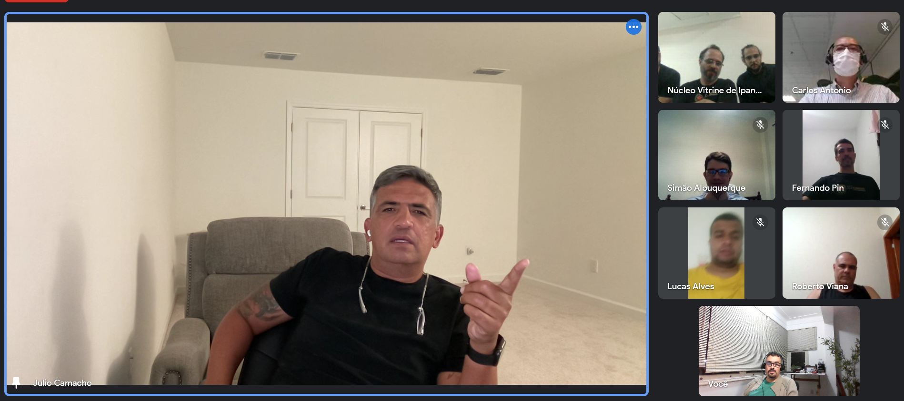

Num dos encontros sobre temas fundamentais da nossa família, Si Fu frisava como é essencial que a transmissão do Ving Tsun seja completa, que ela não pode ser feita de forma parcial.

Lembrei de uma história sufista sobre três morcegos cegos que encontravam um elefante pela primeira vez:

O primeiro tentou passar por baixo do elefante, quase foi pisoteado e gritou:

— *"Cuidado! O elefante é um pilar gigante pronto para te esmagar!"*

O segundo passou próximo à tromba:

— *"Não! o elefante é um tubo flexível, deve ser uma cobra! vai dar o bote a qualquer momento!"*

O terceiro, menos afoito, pousou nas costas do elefante:

— *"Calma! o elefante é uma cama quente e dura. Vamos descansar?"*

Essa história tem [variações sendo contadas desde 500 AEC](https://pt.wikipedia.org/wiki/Os_Cegos_e_o_Elefante) e ilustra de forma simples o que Si Fu nos explicava:

***Um sistema não pode ser compreendido analisando suas partes isoladamente.***
