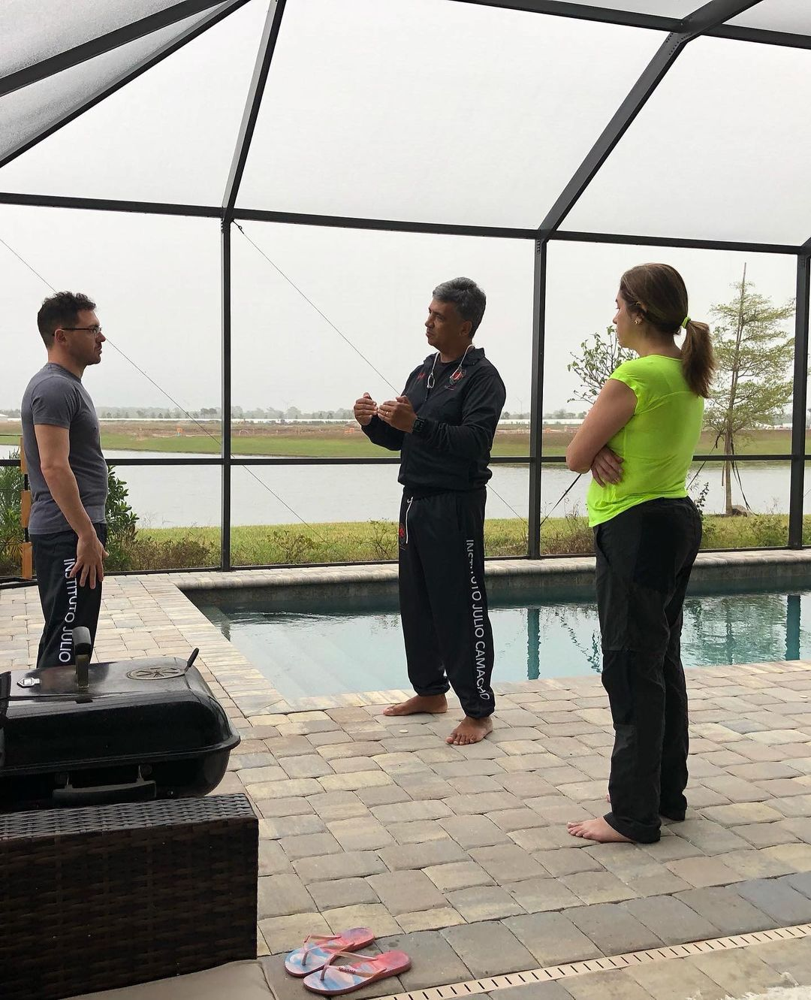
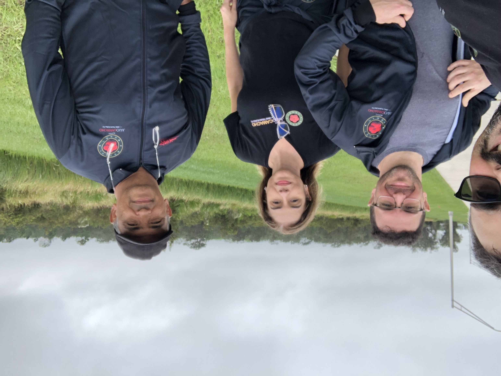
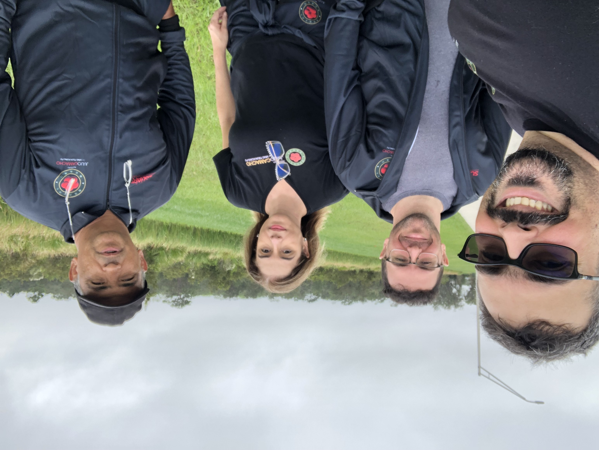

O dia de ontem foi enorme. O que soa engraçado já que todos os dias têm umas 24 horas.

Então vou dividir as publicações em algumas partes para não congelá-las por conta disso. O plano atual é:

- Início do dia (essa parte que estamos)
- Preparando a refeição
- A aposta do Thanksgiving

Então vamos!

### Início do dia

Teríamos um dia cheio, então começamos cedo com práticas e uma caminhada.

Eu sempre admiro o quanto o Ving Tsun é fractal. Quanto mais investigamos, mais detalhes encontramos. Como uma matriosca (aquelas bonecas russas), cada vez que abrimos uma camada, outra se revela.

Passamos vários bons minutos dedicados ao primeiro Gwai Jaang 跪踭 e como ele se conecta ao segundo. É o detalhe de um detalhe de um dos primeiros movimentos da sequência.

Depois saímos para uma caminhada rápida para nos preparar para o dia.

Discutimos distribuições de sequências, prevenção de fraudes, conspirações mundiais e outras banalidades.

Isso corresponde a mais ou menos uma hora daquele dia gigante. Depois da "celebração do consumismo" publicarei as partes restantes.

Até!

---

*T L Si - Thiago Silva* 
*Moy Chi Yau Si* 
*梅 知 友 士*
