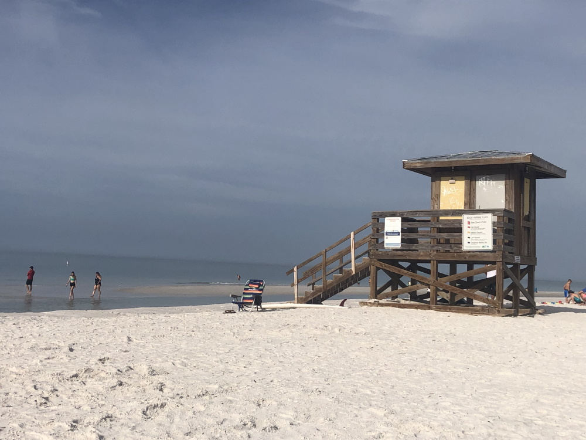
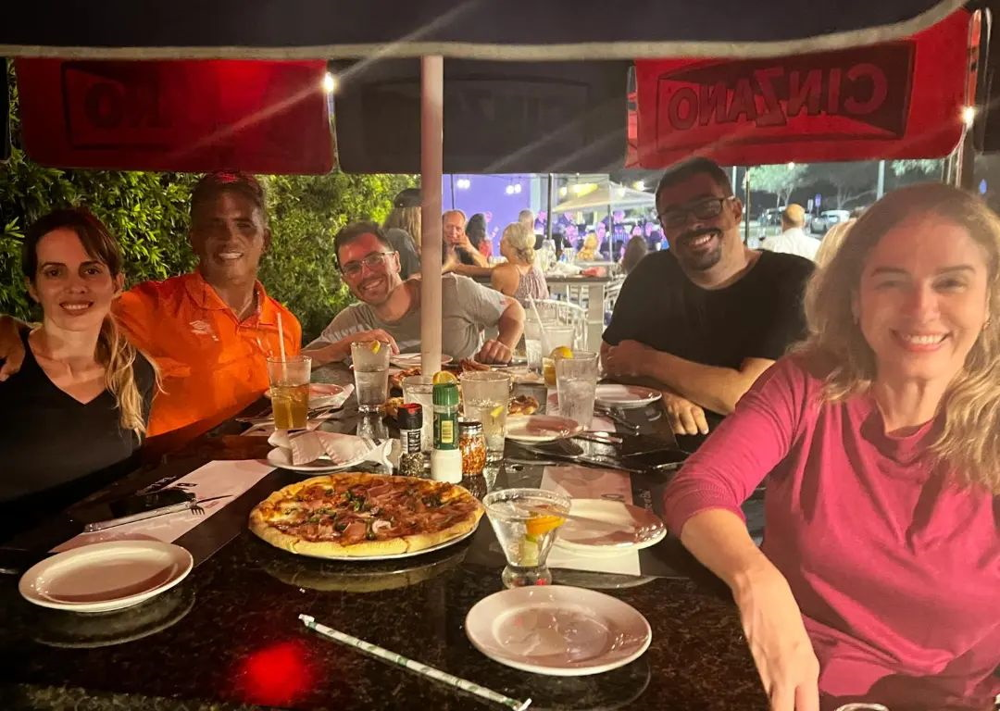

### Conversas

Iniciamos o dia com uma frustrante experiência de Black Friday. Chegamos numa Best Buy com presença policial, mas os preços praticamente não mudaram. Questionávamos se tínhamos perdido informações por não sermos locais, mas nada nos convencia.

No rádio, o locutor comentava como era frustrante que as pessoas não se agredissem mais nas filas. Agora faziam pedidos no final do Thanksgiving em casa, e o evento perdeu seu encanto anterior. Concordei silenciosamente, sem intenção de comprar nada, apenas observar esse experimento social in loco.

Voltamos e iniciamos treinamentos. A luz estava maravilhosa para a prática.

Conversamos em casa e depois saímos para aproveitar o lindo dia. Si Fu nos sintonizava enquanto lembrávamos de conversas similares do passado. Muito do Kung Fu se construiu em momentos assim. Como trabalhava perto do Mo Gun e morava próximo de Si Fu, pegávamos caronas quase todos os dias, falando aleatoriedades. Pequenos atos acumulam gerando grande diferença. Como disse Aristóteles: "A excelência não é um ato, mas um hábito."

Em Hong Kong existia prática marcial chamada Gong Sau 講手 (braços que conversam). Tem algumas limitações de saúde, então meu Gong Sau funciona com menos braços.

### A Praia

Si Fu sugeriu iniciarem pelas sequências. Comecei com dificuldade no controle de espaço no Dar Hung Jong 打空樁. Diante de espaço infinito, segui livremente e quase fui parar na água.

Antunes tem toneladas de energia acumulada e propôs prática diferenciada de Chi Sau. Treinamos soltando a mão, mas passei do ponto e precisei pedir pausa. Nosso Gong Sau perdeu o Sau e partimos para outra praia.

Fomos para Siesta Key Beach. Si Fu estacionou com Antunes enquanto comprávamos água. Num quiosque, via glamurosa foto de frappuccino e não resisti. Quando nos encontramos, vieram rindo: "A gente sabia que você ia pedir um desses."

Voltamos para almoçar. Si Fu nos deu tempo livre. Pretendia escrever, mas ele precisaria sair para abastecer e entregar item para Si Mo. Aproveitei para conversar mais com ele. Nem lembro última oportunidade dessas, talvez mais de 6 anos. Foi muito significativo.

Ao voltar, trabalhamos Carmen, Antunes e eu alternando entre Chi Sau e bricolagem até o jantar no Café Barbosso. Comemos pizzas deliciosas ao som de magnífica Jazz Band.

Nem com o melhor planejamento o dia poderia ter sido tão especial.

Hoje a agenda está indefinida. Estamos nos planejando para encontrar com Si Suk Úrsula, otimizando tempo já que Carmen precisará retornar na segunda.

---

*Thiago Silva*
*Moy Chi Yau Si*
*梅 知 友 士*
