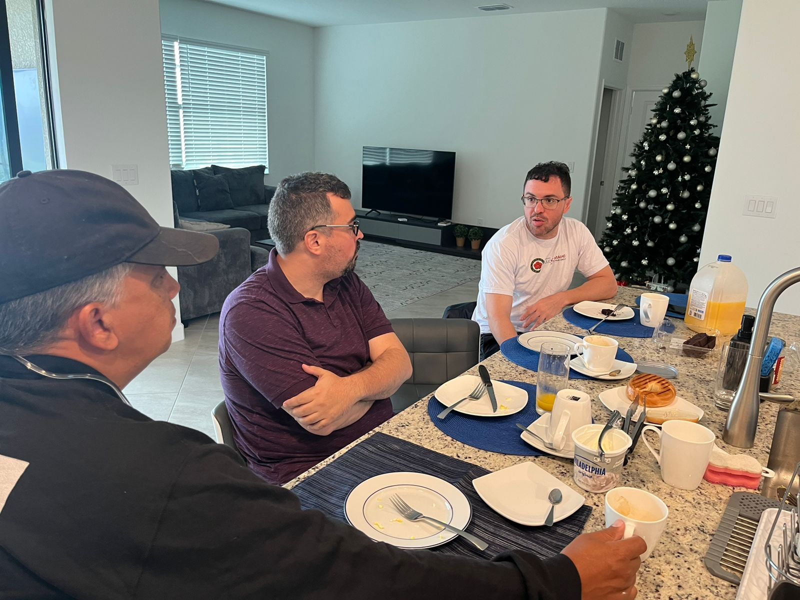
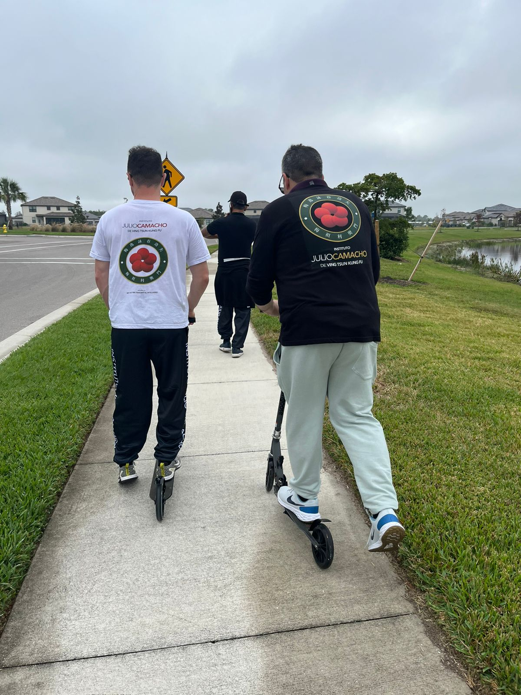
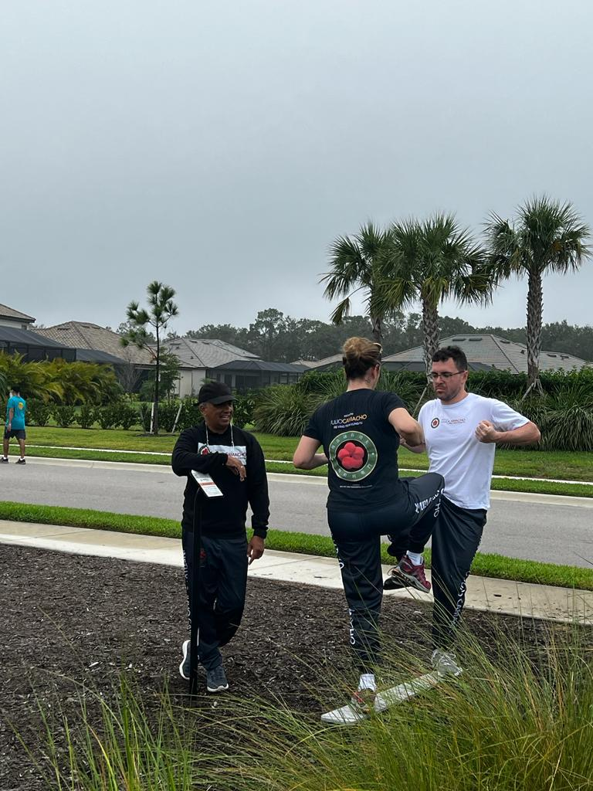
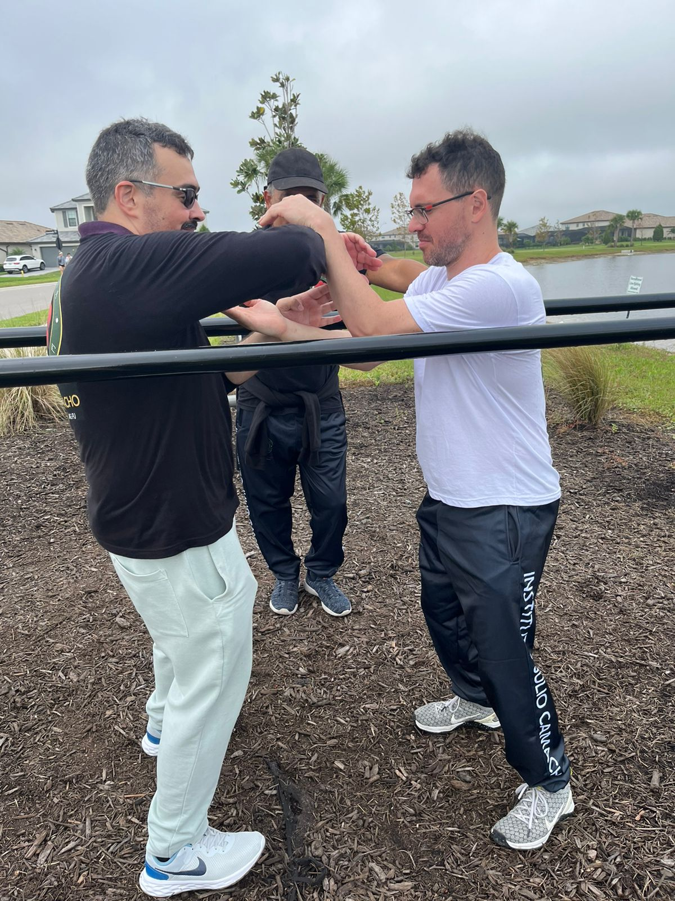
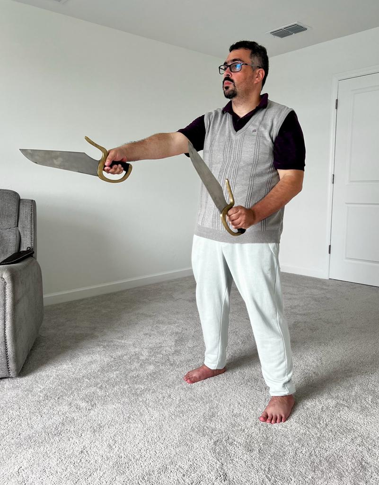

O dia ontem foi gigante e estamos dividindo em duas partes para poder cobrir tudo. Tivemos tantas fotos boas ontem que o formato será no estilo "log de fotos" para poder postar tudo sem interrupção (também estou um pouco atrasado e esse formato agiliza bastante; mas não contem para ninguém)

### Café

Começamos o dia com um belo café preparado pelo Carlos Antunes, que tem sido nosso "chef" nessa viagem, habilidade que eu acho que ele poderia se aprofundar.

### Patinetes

Ao sair para nossa caminhada, me deparei com o Si Fu e dois patinetes. O plano seria uma corrida leve hoje, como não posso correr, a solução era usar os patinetes para que pudéssemos acompanhá-los.

Acho que eu nunca tinha andado de patinetes antes, esperava que fosse um "skate com volante". Com um pouquinho de Kung Fu me saí bem.

### CrossFit

O condomínio do Si Fu tem um grande lago com equipamentos de academia espaçados ao redor. Fomos caminhando e parando em cada um descobrindo como usá-los para treinar Kung Fu.

#### Barra Elevada

O primeiro foi uma barra elevada onde nos divertimos com Chi Geuk por um tempo.

#### Barras

Depois barras. Primeiro as comuns para se elevar, em seguida barras paralelas.

**Gum Gai Duk Lap** e **Chi Sau entre barras paralelas** — experiências inusitadas que mostraram como o Kung Fu se adapta a qualquer ambiente.

### Kung Fu

Ao voltar almoçamos, Si Fu me chamou para um treino reservado de Baat Jaam Do 八斬刀.

### Sorte

Tínhamos alguns itens a mais para comprar e fomos num mall próximo e aproveitamos para jogar na loteria. O prêmio corre dia 29/11 torçam aí.

Mais tarde fomos treinar no Waterside Place e visitamos minha querida Si Suk Úrsula, mas fica para a próxima postagem.

---

*Thiago Silva*
*Moy Chi Yau Si*
*梅 知 友 士*
