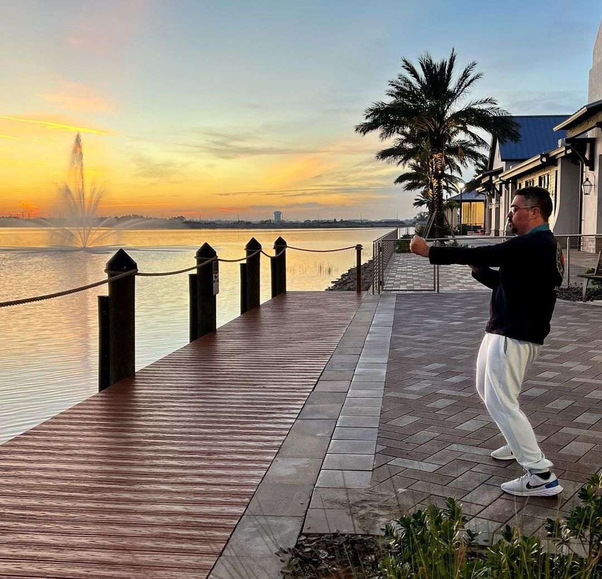
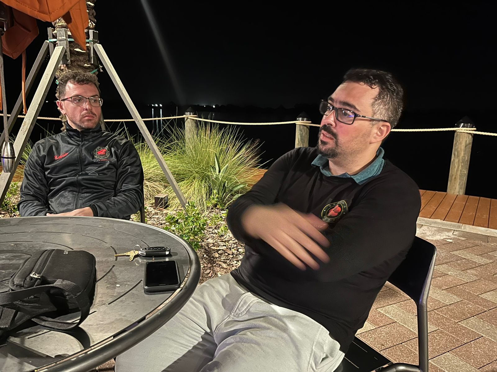

Tanto Carmen quanto Antunes já cobriram super bem esse dia, então vou adicionar as fotos restantes que valem a pena compartilhar e alguns comentários.

### Luz

Bem impressionante a paisagem de Waterside Place, podemos ver algumas "tartarugas chinesas" nadando e conforme o dia foi se pondo fomos agraciados com uma paisagem belíssima.

### Práticas

Praticamos pesado. O foco era Biu Ji, o plano era falar menos e praticar mais, mas falhei miseravelmente.

### Mais Conversas

Conforme Antunes comentou, fechamos a prática falando de diversas características nossas, como nós e outros irmãos lidam com elas.

SIGAMOS!

---

*T L Si - Thiago Silva* 
*Moy Chi Yau Si* 
*梅 知 友 士*
