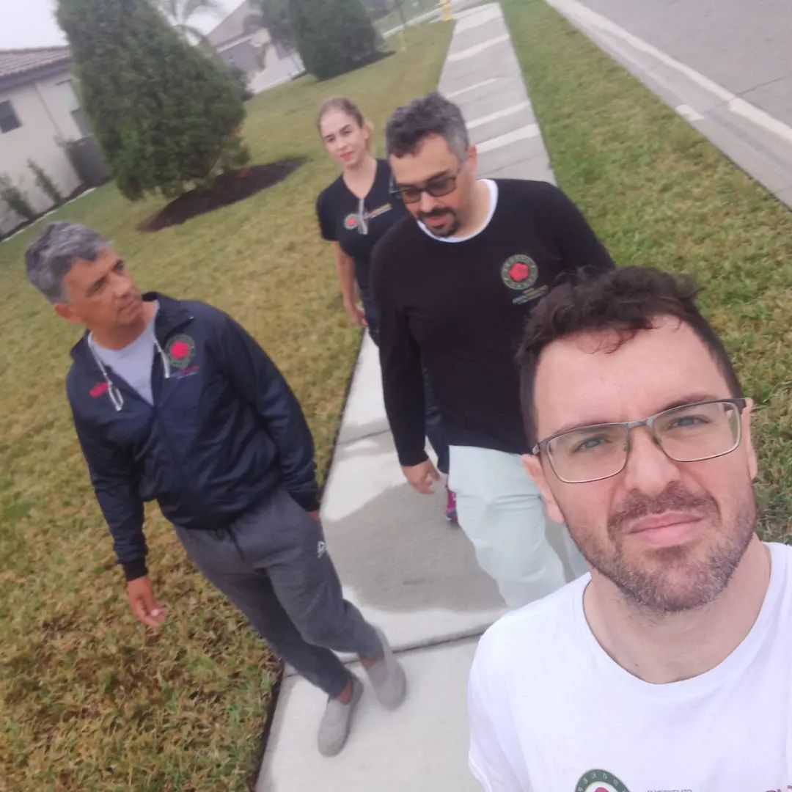
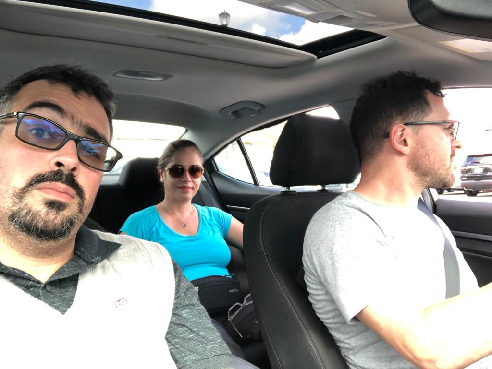
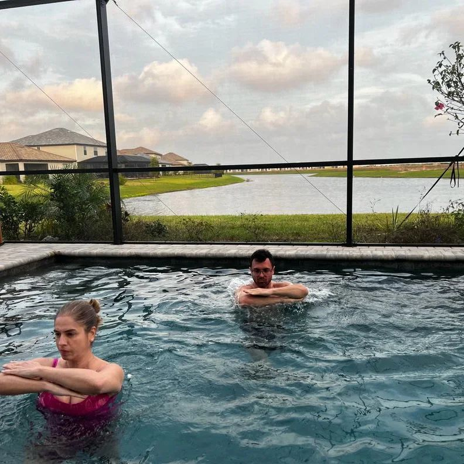
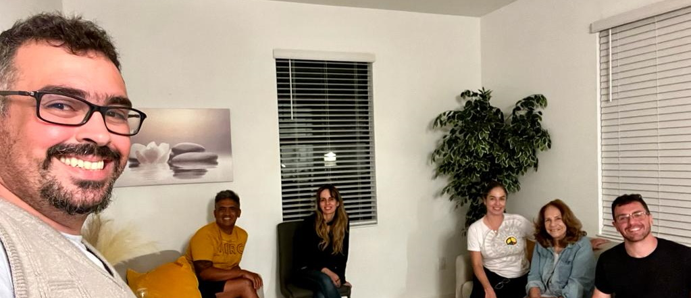

### Caminhada

O dia começou com a caminhada matinal de costume.

### Farmer's Market e Costco

O Costco de fato tem bons preços, consegui comprar alguns itens que estava precisando a preço bem mais em conta do que o esperado.

Si Taai Vera fez diversas afirmações sobre os hot dogs do estabelecimento, que se provaram corretas. Apesar de simples e acessíveis, a comida era muito elogiada.

### Práticas incomuns

A tarde trouxe a montagem de uma TV, e os materiais da embalagem proporcionaram oportunidades para exercícios criativos de treinamento:

**Plástico bolha:** Praticamos Chi Sau usando plástico bolha como superfície de treino.

**Esgrima de plástico:** Uma prática informal de esgrima se seguiu.

**Treino na piscina:** Carmen e Antunes conduziram sessões de prática na piscina.

### Encerrando

Ao entardecer, fizemos um churrasco. Si Fu orientou o tempero da carne. Uma reunião de despedida homenageou a partida da Carmen, com os participantes refletindo sobre suas experiências durante esse período.

---

*Thiago Silva*
*Moy Chi Yau Si*
*梅 知 友 士*
