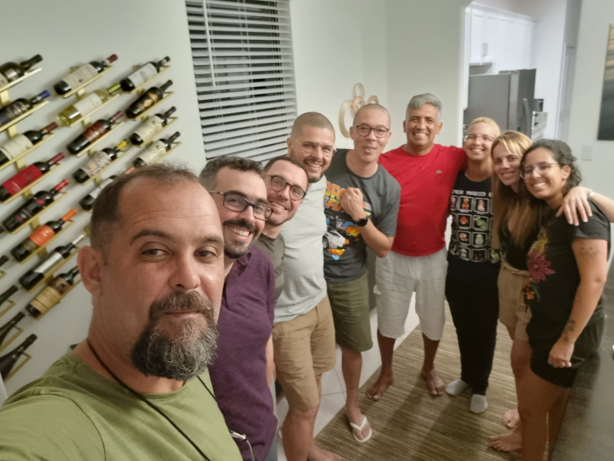
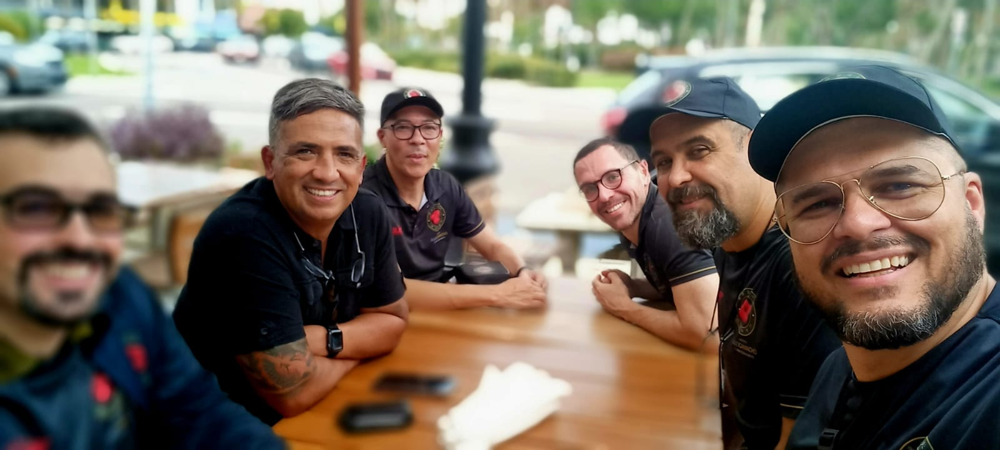

Comecei a escrever esse texto no dia -13 mas fui adiando a publicação, eventualmente compartilhando no dia 1 quando o grupo da imersão finalmente se reuniu.

Cada turma é única. Diferente da imersão anterior onde os participantes foram confirmados com meses de antecedência, a composição deste grupo permaneceu incerta até o último mês, com emoções dramáticas no aeroporto envolvendo Carlos e Cláudio.

O time teve dificuldade em agendar reuniões de alinhamento devido às agendas lotadas. Entretanto, Carlos Antonio solicitou uma importante reunião pré-partida comigo e Alex no dia -13. Apesar da ansiedade na preparação, esta se provou "uma das reuniões mais produtivas que tive nos últimos tempos", com a abordagem direta de perguntas do Carlos que ajudou a resolver pendências para os participantes mais novos.

Uma lição acidental veio do Antunes em Ipanema. Quando ele listou opções de restaurante e eu respondi com "qualquer coisa serve para mim", Antunes retrucou: "Você não está ajudando em nada!" Isso ilustra como a indiferença falha em contribuir de forma significativa.

Conectando ao dia 1, a reunião da noite seria "a hora de se colocar" — referindo-se a como a colaboração desta turma finalmente começou quando todos estavam fisicamente presentes juntos.

Este texto originalmente pretendia explorar como perguntas melhoram a vida, mas reservo essa discussão para outra hora.

---

*T L Si - Thiago Silva* 
*Moy Chi Yau Si* 
*梅 知 友 士*
