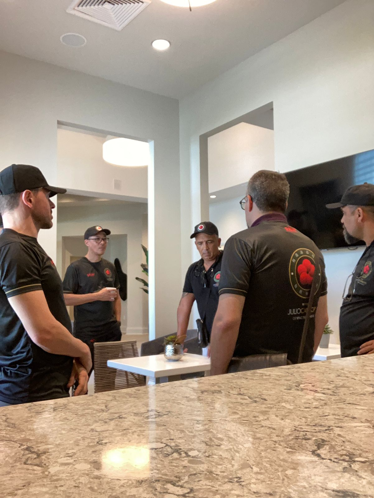
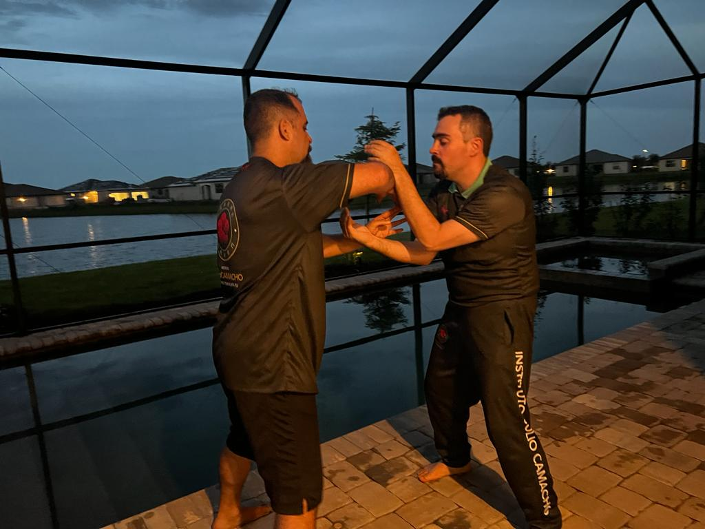

No texto de ontem comentei o quanto as perguntas do Carlos Antônio ajudaram numa das reuniões de pré-evento, entretanto divaguei para outro tema e juntar os dois tópicos resultaria num texto muito longo (e ainda mais atrasado). Então joguei para o texto de hoje.

O segundo dia da imersão foi cheio de felizes coincidências, mas já escrevi sobre serendipidade na imersão passada; uma delas foi que no café da manhã falamos sobre o prêmio Ignóbil de Administração de 2019: 5 assassinos foram se contratando uns aos outros para matar um alvo; Ao final o último assassino ia receber apenas 100 mil yuans (13 mil dólares) e decidiu que era melhor subornar a vítima para não ter que executar o serviço — a vítima procurou a polícia e todos foram presos. Infelizmente nenhum dos participantes estava em liberdade para receber a premiação.

Por sinal, o prêmio são pomposos 100 trilhões de dólares do Zimbábue — já pensou em ser trilhonário? É só ter uma pesquisa selecionada pelos "Anais da pesquisa improvável" (mas não se precipite, essa quantia não equivale nem a 50 dólares).

A premiação foi criada como uma sátira ao prêmio Nobel, a ideia é identificar pesquisas que primeiro façam as pessoas rirem e depois pensar. Isaac Asimov costumava dizer que a coisa mais excitante para se ter em ciência não é o "Eureka", mas sim "que engraçado ou estranho né?!" ("well, that's funny"). Numa alusão ao processo de fazer ciência: primeiro você tem uma questão (hipótese) então ela será testada, se for reproduzível por outros então pode ser considerada ciência até que alguém encontre outra hipótese.

Quando temos acesso a um "Eureka", não percebemos que o velho Arquimedes deitou numa banheira e ficou pensando o porquê o patinho de borracha subia, por que o banheiro dele ficava todo molhado quando ele pulava nu e flácido na água, ou porque ele ficava mais leve relaxando boiando.

As pessoas costumam me conhecer por ser uma pessoa que sabe de tudo, ser inteligente, e quase sempre se surpreendem quando me fazem uma pergunta de trivialidades que eu não sei a resposta. Eu sempre explico que esse é o meu truque: Sou uma pessoa curiosa, sempre que alguém me faz uma pergunta que eu não sei, eu jogo num cantinho mental e vou pesquisar. Faça isso por anos a fio e você vira uma enciclopédia de inutilidades como eu.

Trazendo de volta para o Kung Fu, a primeira vez que me lembro de perceber essa característica minha foi numa viagem com o Si Fu à Friburgo em 2006 ou 2007 eu acho. Paramos num restaurante de estrada e só tinha arroz parboilizado, Si Fu virou para mim e perguntou: "por que ele tem esse nome, Silva?" eu não sabia soltei um: "Ih! Si Fu", ele balançou a cabeça e disse "Lamentável".

*(Os meus Si Hing dessa época vão lembrar exatamente da expressão, do gesto que o Si Fu fazia nesses casos)*

Não tínhamos acesso fácil à internet, então só me restava guardar a frustração para casa, mas eu sempre ficava feliz pois já tinha algo para pensar e procurar.

Eu até acho que a pesquisa instantânea acaba fazendo mal às relações: ao quebrar o ritmo da conversa abrindo o celular para pesquisar, acabamos nos desconectando. Era muito mais legal quando as pessoas se engajavam pensando juntas para tentar responder algo inusitado.

Por sinal, eu nunca tive outra deixa para responder ao Si Fu o que é a parboilização, a pergunta nunca mais surgiu — entretanto hoje posso dizer sem pesquisar que é um processo em que o arroz é semi-cozido acabando por absorver parte dos nutrientes da casca ficando mais durável e saudável *(agora ele vai ter acesso a essa informação totalmente irrelevante)*.

Uma grata surpresa tempos depois foi o Si Fu ter colocado no meu nome Kung Fu o 知 *(Chi)*, que pode ser traduzido como saber, ter conhecimento e sempre o carreguei com orgulho.

De volta à imersão, mais tarde estávamos praticando Chi Sau durante um longo período. Já cansados um praticante se queixou que a performance tinha penhorado e a resposta simples era: "Mas você está golpeando em todas que tenta". Si Fu interrompeu: "Quem disse que essa é a métrica de um bom Chi Sau?"

Mais uma questão para nos mover, para pensar.

Até!

---

*Thiago Silva*
*Moy Chi Yau Si*
*梅 知 友 士*
