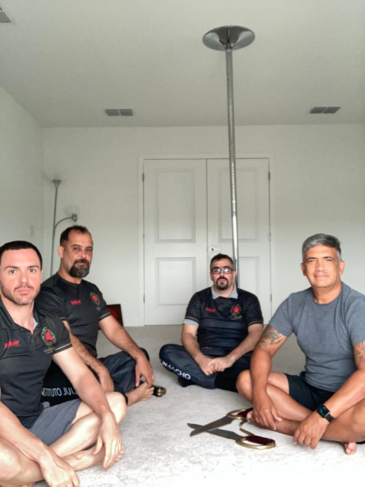
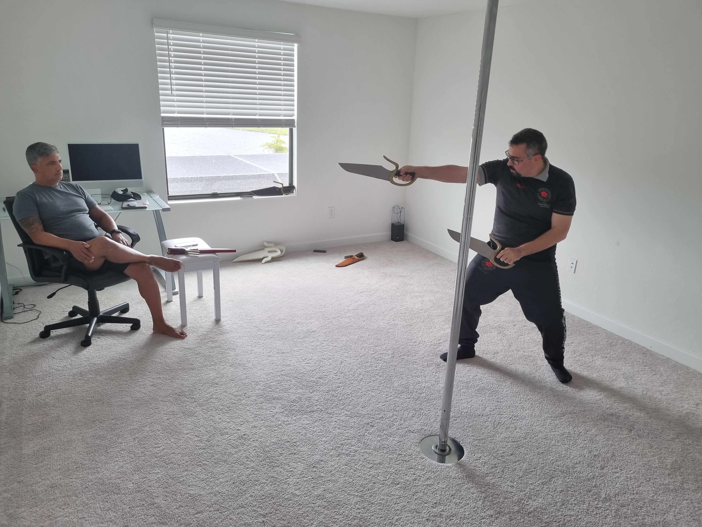

Hoje Si Fu chamou Thiago, Antunes e Claudio para uma conversa aberta sobre o entendimento do sistema Ving Tsun de praticante para praticante.

O sistema em si é um termo muito caro para mim, dado meu histórico profissional investindo tempo entendendo pontos de conexão, reforço e equilíbrio. Entretanto, essa discussão abstrata fica para depois.

Para desenvolver Kung Fu, o Ving Tsun precisa abraçar o incognoscível, abraçar o um e seu oposto, Yin e Yang. Um quebra-cabeça multidimensional infinito onde apesar de ter todas as peças, sempre haverá lacunas entre suas juntas.

Como reconciliar o irreconciliável? Como transmitir o intransmissível? Somente o movimento é capaz de quebrar nossas correntes.

O grupo então executou seu entendimento da sequência com honestidade. Si Fu posicionou vários pontos, resolveu dúvidas e limpou o caminho para o avanço. Estamos apenas no terceiro dia.

Recolhemos "os pedaços de nossas cabeças explodidas" e fomos à praia para esvaziar para o dia seguinte.

---

*Thiago Luiz Silva*
*Moy Chi Yau Si*
*梅 知 友 士*

*Crédito da imagem: Bing com DALL-E; prompt: "person manipulating a moebius strip, alone, stars, sci-fi, realistic"*
