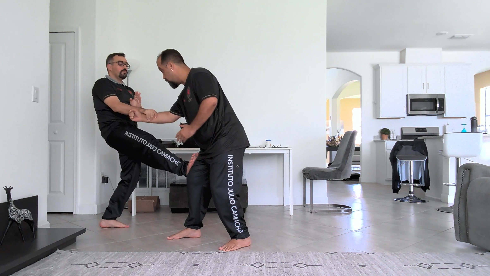

Passei boa parte do dia com o Cláudio estruturando as aulas práticas para o programa fundamental. Fizemos 11 propostas, vamos fazer algumas aglutinações, adaptações e temos talvez 5 aulas prontas.

O objetivo é completar a estruturação de todas as 12 aulas práticas do programa fundamental antes do fim da imersão.

Depois de várias horas de trabalho, Si Fu nos deu algumas ideias, fornecendo direção e orientação adicionais.

Ainda estou escrevendo um texto sobre o café da manhã, mas está demorando muito, então decidi adiantar o principal logo.

---

*Thiago Silva*
*Moy Chi Yau Si*
*梅 知 友 士*
