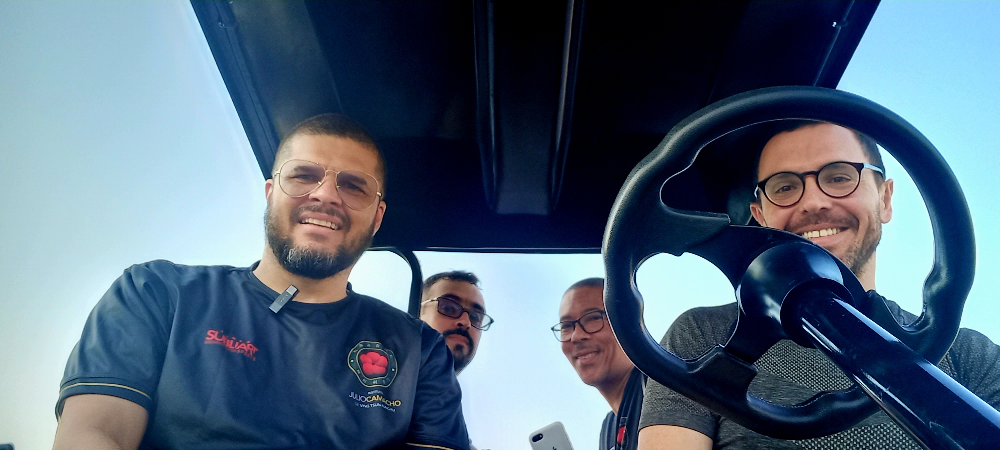

Começamos o dia com a prática matinal. Ontem conseguimos pegar o nascer do sol com uma iluminação linda.

É muito difícil uma foto fazer justiça à visão, por isso bons fotógrafos são valorizados apesar de todos carregarmos uma câmera no bolso. Acho que o cinema tem uma vantagem por combinar tempo de imagem (e som), mas vou guardar a conversa sobre movimento para outra hora.

### Gravações

Tenho algumas encomendas de podcast para essa viagem e venho testando gravações há alguns dias. Gravei com Rangel pelo menos 3 vezes; a imagem nessa publicação é da nossa tentativa de gravar no carrinho de golfe, mas o som falhou.

No início da tarde gravamos com sucesso com Carlos Antônio.

### Aulas do Programa Fundamental

Também fizemos mais uma rodada de gravações para as aulas de fundamentação. Chegamos a 10 aulas gravadas.

Si Fu não resistiu e veio nos dar algumas ideias sobre os fundamentos do Kung Fu — essas certamente virarão outro texto.

### Treino noturno

Uma de nossas rotinas que tem aparecido aqui e ali são as práticas de Baat Jaam Do. Ontem não foi diferente.

### Adendo: Operação Resgate

No meio do dia Alex e Antunes foram fazer compras a pé. No calor da Flórida, um resgate motorizado foi necessário. Faz muito tempo que eu não tinha uma atividade tão divertida; me diverti muito dirigindo o carrinho de golfe a toda velocidade.

---

*Thiago Silva*
*Moy Chi Yau Si*
*梅 知 友 士*
