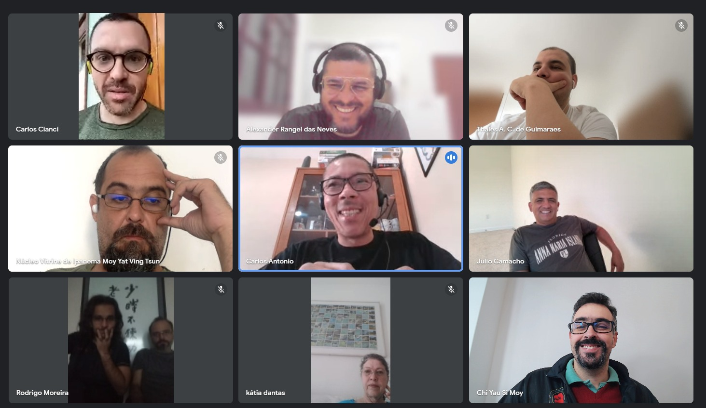
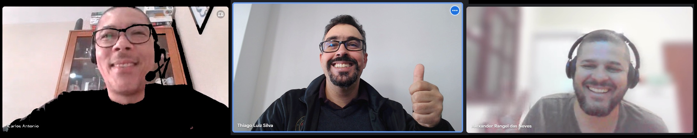

Olá a todos, estamos aqui iniciando mais uma imersão na vida Kung Fu. O evento ano passado foi mais do que especial: com as participações minha, Antunes, Carmen e Alice, mostrou que a vida kung fu pode ser mais rica e produtiva do que a correria do dia a dia, entretanto não tem como ser programada. O que acaba elevando as expectativas para a viagem desse ano.

Eu tradicionalmente começo perguntando quando de fato começou (já escrevi sobre isso aqui) então não vou entediá-los com isso novamente, vou me ater nesse post apenas a uma pequena descrição e a alimentar algumas expectativas.

### A comitiva

Um ponto que é notável quando se está em uma posição de liderança é que todo time é imutável e por outro lado ele muda o tempo todo. Se um membro do time se ausenta, toda a dinâmica muda. Se mais uma pessoa é inserida, tudo muda. Parafraseando o Heráclito e conectando ao Heisenberg: Não se pode medir duas vezes a velocidade de um mesmo time, quando vc mede novamente, o simples fato de medir, já o modifica.

Métricas deveriam funcionar como bússolas, elas apontam a direção, já vi vários times se desfazendo em busca de valores arbitrários, apenas para saciar a vaidade de alguém que nem sabe porque quer aquele número. Leu maravilhado "na internet" e acha que descobriu o Santo Graal. É o tolo olhando para o dedo do sábio quando ele aponta para lua.

Desculpem a digressão, quase comecei a falar das métricas do facebook, google, YouTube… mas deixe-me voltar para minha bússola aqui. Comecei a falar de times para salientar o quanto o grupo atual é diferente do anterior. Se na primeira imersão éramos 3 pessoas ordeiras nesse temos 3 grupos bem distintos:

- **Eu e Antunes**: mais de 20 anos de experiências compartilhadas, apesar do pouco contato de uns anos para cá, quase sempre consigo intuir o que ele faria em determinada situação e percebo que ele tem a mesma leitura de mim. Eu tenho certo orgulho desse ponto em que estamos, eu não preciso entretê-lo nem ele a mim. O simples fato de estarmos juntos fazendo algo é suficiente para considerar o dia ganho — pode ser uma grande roubada ou um excelente jantar, sigamos juntos!

- **Carlos Antônio e Alex Rangel**: O simples fato de colocar o sobrenome já mostra que não temos tanta intimidade. Mas me apoiando nas falas do Baai Si do Rangel, são duas pessoas que tem aquele olhar de maravilhamento. Que veem e extraem a beleza em tudo. Ainda ontem comentava com minha esposa o quanto o Carlos é sereno, já traz uma paz só de responder a pergunta dele sobre como levar medicação na viagem.

- **Cláudio**: Esse fica no meio do caminho aqui. Como o Si Fu diz: "o Cláudio fica no meio e toma pancada de todo lado". Já passamos por poucas e boas. Ele traz uma energia caótica que quando for bem direcionada vai mudar o mundo — "pau para toda obra" sendo sempre um prazer fazer ou falhar em algo com ele.

Percebem a riqueza do cenário atual? Vamos ver onde vai dar, mas certamente será transformador para todos os envolvidos.

Esse é o pontapé inicial, o kick off, dessa segunda semana de imersão na vida kung fu. Somos 5 integrantes diretamente envolvidos, mas também estamos contando com a ajuda do time no Brasil para garantir as publicações diárias, fotos e compartilhamento desses momentos ricos com mais pessoas.

É claro que também temos que agradecer a recepção do Si Fu e Si Mo que tão generosamente abrem as portas de suas vidas para nós. É sempre gratificante perceber a alegria que eles tem de poder nos receber — Obrigado!

Até!

---

*Thiago Luiz Silva*
*Moy Chi Yau Si*
*梅 知 友 士*
