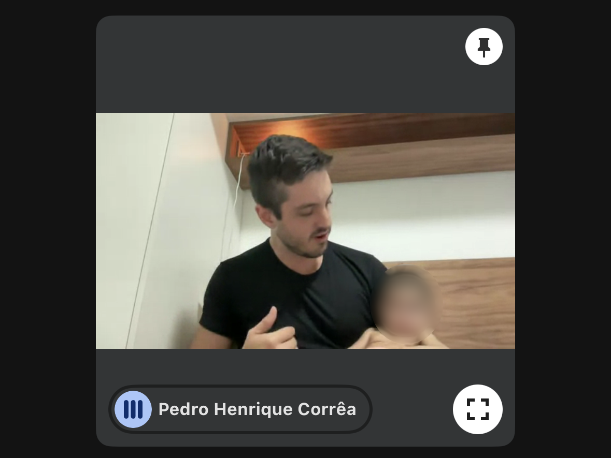
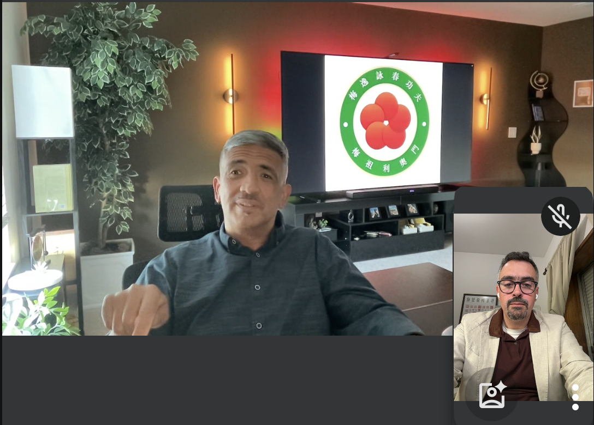
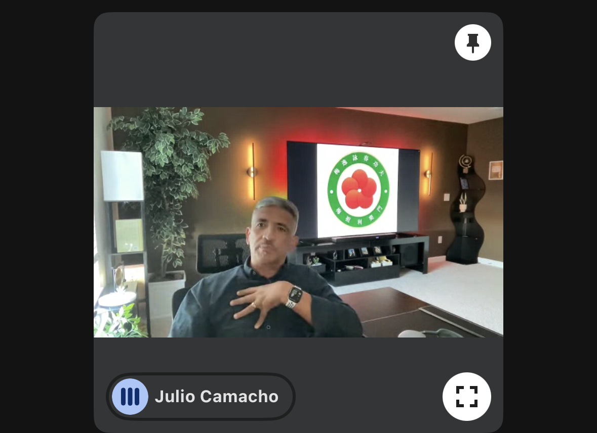

O Programa de Mestrado alimenta o livro que venho escrevendo, um guia do sistema Ving Tsun lido pela lente do pensamento sistêmico. Si Fu abriu o terceiro encontro reafirmando o objetivo: *"queremos registrar esse material, escrevê-lo!"*

Cada fala dos irmãos, cada pergunta, cada provocação vira matéria-prima.

### As falas dos Si Hing

**[Mestre Márcio Lopes — A arte da excelência e o aretê grego](https://scholion.thluiz.com/notes/marcio-lopes-arete-arte-da-excelencia/).** Kung Fu como arte da excelência, aplicada ao cotidiano. Si Fu puxou o conceito grego de *aretê*: fazer precisamente o que precisa ser feito dentro do cosmos, entendido como uma organização datada. Usou a profissão do Márcio como exemplo: aretê em imóveis é colocar a pessoa na melhor casa possível.

**[Marcos Davi — Kung Fu é vida](https://scholion.thluiz.com/notes/marcos-davi-kung-fu-e-vida/).** Definição herdada do Si Taai Gung. Único não-mestre do encontro, Marcos trouxe a casa como lugar de maior exigência, onde ele se pega não ouvindo, sendo "muito eu". Si Fu fez duas correções. Primeiro, separou Kung Fu (aspecto subjetivo) de Ving Tsun (aspecto objetivo): manter-se na linha central numa conversa é Kung Fu. Depois, puxou a etimologia de marcialidade: vem de Marte, mas a guerra original era a que o homem travava consigo mesmo.

**[Mestre Guilherme Farias — Os três pilares: trabalho, energia, maturidade](https://scholion.thluiz.com/notes/tres-pilares-kung-fu-trabalho-energia-maturidade/).** Abriu os trabalhos com uma leitura dos ideogramas de 功夫 como três camadas do praticante: 工 (trabalho mecânico), 力 (energia aplicada) e 夫 (maturidade que transborda para a vida). Si Fu complementou que o praticante está sempre em todas as etapas ao mesmo tempo, e que o saber sistêmico é interativo. A pessoa que faz Siu Nim Tau hoje não é a mesma que fez ontem.

**[Mestre Pedro Henrique Corrêa — Humanidade é escutar o outro](https://scholion.thluiz.com/notes/pedro-henrique-correa-humanidade-escutar-o-outro/).** Kung Fu como habilidade adquirida no tempo, medida pela adaptabilidade ao ambiente. O ponto comum da família Moy Jo Lei Ou é a humanidade, e humanidade é escutar o outro. Pedro perguntou se ambientes perversos são de baixo potencial para Kung Fu. Si Fu respondeu que qualquer ambiente com troca favorece o desenvolvimento, e puxou o conceito freudiano de perverso como "dobrar em um caminho não natural".

*Mestre Pedro explicando para a filha o que é Kung Fu*

**[Mestre Claudio Teixeira — Servir, liderar, legar](https://scholion.thluiz.com/notes/claudio-teixeira-tudo-reacao-servir-liderar-legar/).** Três movimentos. Se tudo é reação, a ideia de ação pura se desfaz e o Kung Fu vira refino da reação até ela carregar mais percepção. Escapar da ideia de dirigir é escapar da pretensão de controle. E uma tríade como definição: servir, liderar, legar. Si Fu pediu para retirar a cronologia. Quem lega segue servindo, quem lidera lidera em função de alguém.

**[Mestre Vladimir Anchieta — Saber se adaptar ao outro](https://scholion.thluiz.com/notes/vladimir-anchieta-saber-se-adaptar-ao-outro/).** Kung Fu como relacionamento com o mundo. Adaptar é reconhecer o terreno e jogar dentro dele sem abandonar quem se é. O treino real acontece em casa, com esposa, filho e neta. Si Fu usou a fala (Vlad é cristão devoto) para abrir uma ética que vale para qualquer Si Fu: a forma mais honesta de ajudar o discípulo é dar ferramentas para ele pensar, não impor a própria crença.

### A arte de saber viver a própria vida

Quando chegou a minha vez, logo antes do Si Hing Vlad, fui no sentido dos termos que não têm tradução, reforço sempre a ideia de que não há resposta sobre a [questão do que é Kung Fu](https://scholion.thluiz.com/notes/rascunho-sobre-o-que-e-kung-fu/).

Em termos de pensamento chinês, e do [*aretê* grego](https://scholion.thluiz.com/notes/arete-adequacao-ao-cosmos/) que o Si Fu acabara de discutir com o Márcio, o principal era saber como viver a própria vida. Si Gung comenta: Kung Fu é a arte de saber viver a própria vida. Viver de acordo com os próprios valores.

Recorri ainda a outra frase, "a forma como você faz qualquer coisa é a forma como você faz todas as coisas", que achei por muito tempo que fosse do [Aristóteles](https://scholion.thluiz.com/notes/durant-excelencia-habito/). Não é. Mas a ideia vale: é cíclica.

Kung Fu é a arte de conseguir fazer as coisas de forma melhor, principalmente segundo a própria ótica. Cabe a cada um julgar o que está fazendo para sempre melhorar.

### Sem sistema, Kung Fu vira refém

Nesse ponto começa a penumbra do sistema. Sem sistema, o Kung Fu para de evoluir. O praticante chega no que considera ápice e, sem arcabouço para continuar refinando, fica refém de si mesmo. Refém do Kung Fu que ele mesmo desenvolveu.

Pode ser bom. Pode ser armadilha. A pessoa fica boa demais para fazer qualquer outra coisa que não seja o que já sabe.

## O Comentário do Si Fu

[Si Fu](https://scholion.thluiz.com/notes/os-dois-si-fu/) complementa a penumbra que abri. Quando a pessoa constrói algo e julga o que está fazendo, esse julgamento é um estabelecimento soberano. Sober vem de "acima". É a pessoa estabelecendo, para si, o que são seus valores.

Mas a soberania não flutua no vazio. Apoia-se num triângulo: um vértice é a pessoa, o outro é o sistema, que dá arcabouço para continuar desenvolvendo; o último é o outro, e especificamente, a relação com o Si Fu.

**Não existe Kung Fu sem Si Fu. Não existe auto-Kung Fu.**

Si Fu insiste que Si Fu é função, não pessoa. Como pai é função. O Pedro, que estava com a filha no colo, não é pai em abstrato. É pai da filha dele. Dos bilhões de outras pessoas no mundo, ele não é pai de ninguém. Sem o filho, não tem pai. Sem o To Dai, não tem Si Fu e vice-versa.

Na ponta do triângulo estão o sistema e a família, representada pelo Si Fu. A soberania do julgamento pessoal não dispensa o encontro com esses dois.

Tem um ponto que ainda estou tentando acomodar no meu pensamento: ao que parece, Si Fu separa o sistema Ving Tsun apenas ao conjunto de técnicas. Eu tenho uma visão mais holística: o Sistema Ving Tsun se baseia na família Kung Fu se replicando e refinando geração após geração. Quando Leung Bok Toa atribui à fundadora, sua esposa, o nome do sistema, ele está dizendo, de certa forma, que o que ele tem veio de um anterior.

Quando Si Taai Gung afirmava que iria transmitir da mesma forma que aprendeu, reproduzia essa afirmação.

Quando Si Gung cria a ideia de denominação Moy Yat Ving Tsun, também está ecoando a mesma ideia.

Quando nós nos vinculamos ao Instituto Julio Camacho, também rimamos o mesmo movimento.

Para mim, a família é parte do sistema. É a partir dela que o sistema se refina e se perpetua (o que eu chamo de "pegadinha" sistêmica).

O conjunto de técnicas não sobrevive no vácuo. Se assim fosse, poderia ser transmitido em livros, internet, vídeos. O que garante a legitimidade e eficiência do próprio processo é o nosso vínculo com a geração imediatamente anterior, não adianta buscar atalhos.

---

*T L Si - Thiago Silva* 
*Moy Chi Yau Si* 
*梅 知 友 士*
