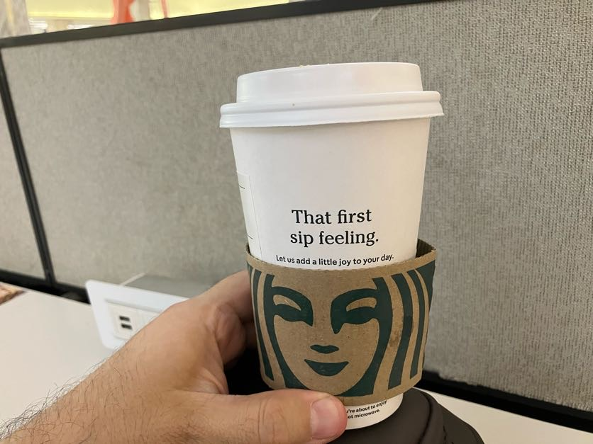
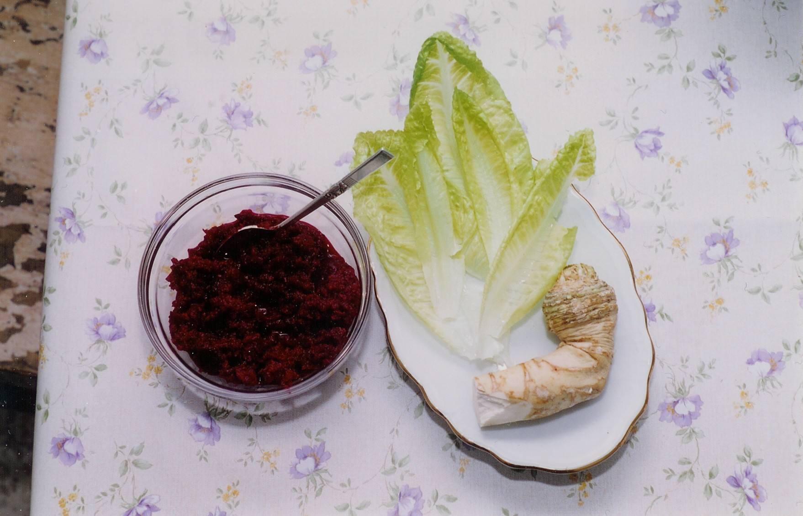
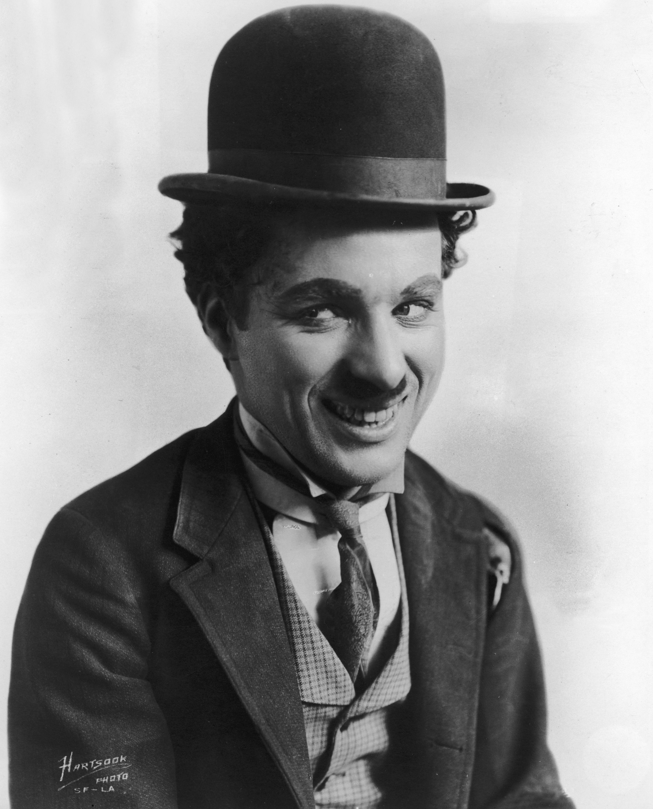

Quando recebi meu Baai Si (cerimônia formal de discipulado) em 2006, o Mestre mencionou que o chá servido costumava ser amargo, simbolizando como relacionamentos para a vida inteira contêm tanto bons momentos quanto dificuldades inevitáveis.

Quase duas décadas depois, reflito sobre esse ensinamento através da metáfora de um Caramelo Machiatto — uma bebida do Starbucks que consiste em doses de espresso em camadas com leite vaporizado e calda de caramelo que não se mistura completamente, criando zonas de sabor distintas.

Faço paralelos com as tradições judaicas, referenciando o Maror (ervas amargas) consumido durante a Páscoa para comemorar as dificuldades, e a sabedoria simples da minha avó: "Isso também vai passar." Conceitos budistas de impermanência são mencionados como temas universais através das culturas antigas.

Lembro de um barista chamado João que me apresentou tanto a versão quente quanto a fria da bebida por volta de 2009-2010 enquanto trabalhava remotamente no centro de São Paulo. A versão gelada começa doce e vai ficando amarga conforme se consome com canudo — João brincava "a vida começa doce e termina horrivelmente".

Rejeito esse cinismo. Em vez disso, sugiro que a vida se assemelha ao Caramelo Machiatto gelado precisamente porque é imprevisível: "A arte é equilibrar entre os pontos amargos e doces que desejamos" para aproveitar a bebida até o final. O Mestre frequentemente esquece de experimentar a bebida e faz expressões de nojo com a doçura.

---

*Thiago Silva*
*梅知友士*
*Moy Chi Yau Si*
