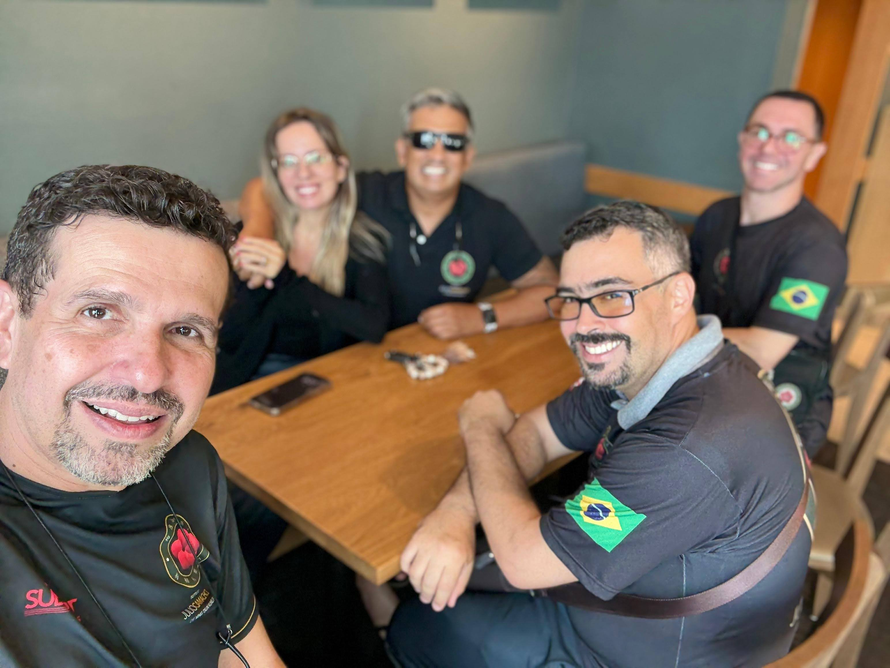

O dia concluiu com uma conversa sobre encontrar prazer nas coisas cotidianas. Si Fu destacou o pensamento hedonista que, ao contrário das concepções populares sobre excessos, visava maximizar o aproveitamento das ofertas simples da vida.

Lembro de Epicuro, que ensinava em jardins e compartilhava pão e água com os discípulos, considerado austero mesmo para os padrões antigos:

> "O anfitrião deste lugar oferecerá bolos e água fresca livremente. Este jardim não provocará o apetite com pratos elaborados, mas satisfará com os presentes da natureza."

Essa filosofia de momentos simples para discutir tópicos substanciais ressoa comigo — viver de acordo com os próprios valores em vez de discussão abstrata.

A noite trouxe sorvete de madrugada enquanto discutíamos se um narrador de vídeo era IA, ultimamente inconclusivo devido ao seu "olhar reptiliano".

A manhã seguinte trouxe uma caminhada pela propriedade com Antonio Henrique. Noto como condições diferentes — horário do nascer do sol, textura da grama, temperatura do ar — tornaram este dia unicamente distinto, e ainda assim todos os dias possuem tal singularidade.

No Panera Bread, a conversa evoluiu naturalmente para política e cinema. Quando Si Fu perguntou sobre filmes inspiradores:
- Si Fu mencionou a série "Ripley"
- Antunes citou "Um Sonho de Liberdade"
- Eu mencionei "Gattaca", depois defendendo a brevidade dos filmes e citando a animação "Gumball" como o ápice da narrativa concisa

Referencio a obra de Annie Ernaux, prêmio Nobel, comparando romances a vitórias no boxe (acúmulo gradual de pontos) versus contos como nocautes — impacto imediato, direto e poderoso em formato comprimido.

O trabalho da tarde focou em Ving Tsun com Antonio, concluído pela chegada do Si Fu. A discussão sobre estratégias esportivas (futebol, futebol americano, baseball) foi adiada por ser longa demais.

---

*T L Si - Thiago Silva* 
*Moy Chi Yau Si* 
*梅 知 友 士*
