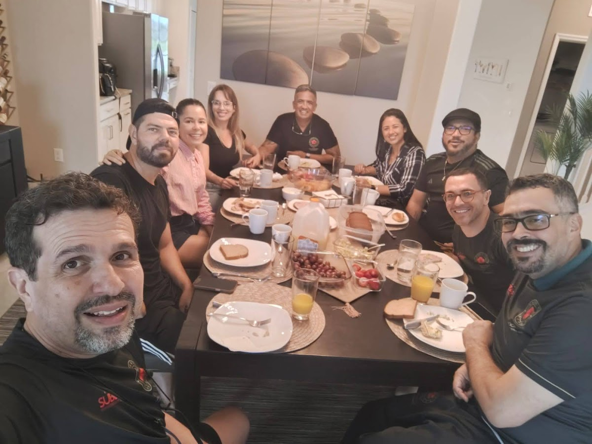

### O Início

O dia começou com treino tradicional no escuro, seguido de uma caminhada matinal para aproveitar as condições climáticas favoráveis.

### Exploração de Equipamentos

Ao longo do percurso, os participantes se engajaram com os equipamentos de ginástica do condomínio, incluindo barras paralelas. Refleti sobre como as pessoas se prendem a padrões ultrapassados e falham em reconhecer o potencial completo das situações.

### O Café

O grupo recebeu uma mesa mista incluindo Si Suk Úrsula Lima (Mestre Sênior), seu marido Ricardo Lopes, e os convidados José e Ana. Si Suk Úrsula é uma figura respeitada na comunidade do Kung Fu.

Os tópicos de discussão incluíram:
- Pesca em Sarasota
- Técnicas de preparação de café do José
- Logística de equipamentos para Portugal e Flórida (Jong e bastões)
- Arranjos potenciais de espaço de treino na casa do Si Fu

### Aula de Fundamentação

Observei que certos indivíduos possuem qualidades distintas — o que os gregos antigos chamavam de "*kharisma*" (dom espiritual divino). Noto que tais talentos podem ser desenvolvidos através do treinamento, particularmente através do Kung Fu.

Refleti sobre o termo chinês "*Tzu/Tzi* 子" (que aparece em "Lao Tzu" e "Confúcio"), que se traduz como criança ou filho, sugerindo que a sabedoria mantém o encantamento infantil.

Ana demonstrou entusiasmo ao executar movimentos com sucesso, provocando contemplação sobre quando as pessoas cessam de experimentar encantamento com o mundo.

### Final do dia

O grupo localizou Ginger Beer, uma bebida não alcoólica e levemente picante que Si Fu mencionou previamente apreciar. Achei razoavelmente satisfatória.

O dia concluiu com prática de facas (*Dao*), onde Si Fu compartilhou vários estágios de sua jornada de treinamento e trocas com seus irmãos, descritos como "particularmente especiais".

### E a salada?

Caracterizei os dias de imersão como ricos em nutrientes, combinando atividades diversas — "uma salada saudável de eventos nos nutrindo e semeando para o futuro."

Entretanto, o destaque do post centra-se na salada do **Little Greek**, onde Jade Camacho trabalha. Declaro ser *simplesmente a melhor salada do mundo, de longe*.

---

*Thiago Silva*
*梅 知 友 士*
*Moy Chi Yau Si*
