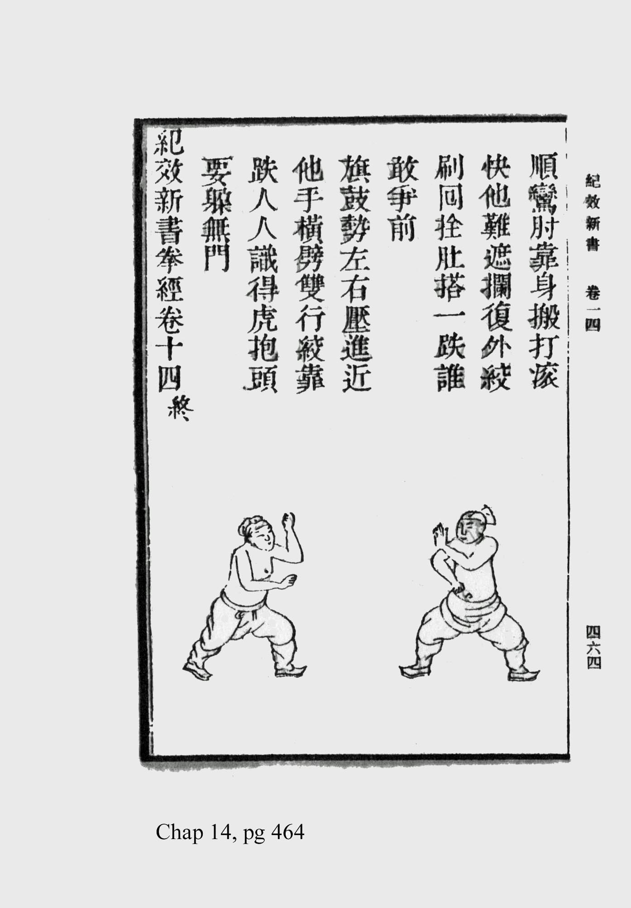

**Qi Jiguang (戚繼光, 1528–1588)**, general da dinastia Ming, escreveu o *Jixiao Xinshu* (紀效新書, "Novo Tratado de Eficiência Militar") por volta de 1560. O capítulo 14, *Quanjing Jieyao Pian* (拳經捷要篇, "Capítulo Essencial do Cânone do Punho"), é a primeira catalogação preservada de artes marciais por um militar chinês: **32 estrofes**, cada uma descrevendo uma postura de combate desarmado em forma versificada (predominantemente sete caracteres por linha).

Tang Hao (唐豪) e Gu Liuxin (顧留馨), no séc. XX, [apontaram](https://ymaa.com/articles/2016/05/the-hidden-taizhu-chang-quan-roots-of-chen-taijiquan) que **29 dos 32 nomes** reaparecem, com formulação paralela, na sequência antiga do Taijiquan estilo Chen, sustentando que Chen Wangting (séc. XVII) absorveu o material ao formular o estilo. Entre as posturas: 懶扎衣 (Lan Zha Yi, "desamarrar a túnica com preguiça", a inicial; grafada 攬擦衣 na tradição Taiji), 拗單鞭 (Ao Dan Bian, "chicote único torcido"), 金雞獨立 (Jin Ji Du Li, "galo de ouro numa perna só").

Logo na abertura, Qi diz que o punho quase não serve para a guerra. Vale como porta de entrada e condicionamento:

> **拳法似無預於大戰之技，然活動手足，慣勤肢體，此為初學入藝之門也。**
>
> *Os métodos de punho parecem não ter serventia na técnica da grande batalha; ainda assim, movimentam mãos e pés e habituam o corpo ao esforço, e são a porta de entrada do iniciante na arte.*
>
> E, na abertura do capítulo: *"Esta arte pouco tem a ver com o soldado; havendo energia de sobra, é também o que a casa marcial deve treinar, mas quem, na tropa, não consegue forçar-se a isso, que faça como lhe convier."* (此藝不甚預於兵，能有餘力，則亦武門所當習，但眾之不能強者，亦聽其所便耳。)

A mesma distinção que o vault registra entre [Kung Fu como processo](https://scholion.thluiz.com/notes/rascunho-sobre-o-que-e-kung-fu/), que ["é vida, não técnica de combate"](https://scholion.thluiz.com/notes/kung-fu-tao-bom-ate-para-lutar/), e Mou Seut ([武](https://scholion.thluiz.com/notes/etimologia-de-mo-wu-6b66/)[術](https://scholion.thluiz.com/notes/etimologia-de-sut-shu-8853/)), a técnica de combate propriamente dita.

Interessante que o nosso Gam Gai Duk Lap (金雞獨立) esteja aí, na segunda postura da lista.

, xilogravura do Jixiao Xinshu")

---

## Texto original: 拳經捷要篇

> Texto do [Wikisource chinês](https://zh.wikisource.org/zh-hant/紀效新書/卷十四) (edição de c. 1560). Tradução de trabalho minha, não atestada de fonte publicada; a versão inglesa de referência é a de Gyves (1993).

### Prefácio

> *(此藝不甚預於兵，能有餘力，則亦武門所當習，但眾之不能強者，亦聽其所便耳。)*
>
> **拳法似無預於大戰之技，然活動手足，慣勤肢體，此為初學入藝之門也**，故存於後，以備二家。
>
> 學拳要身法活便，手法便利，腳法輕固，進退得宜，腿可飛騰。而其妙也，顛起倒插。而其猛也，披劈橫拳。而其快也，活捉朝天。而其柔也，知當斜閃。
>
> 故擇其拳之善者三十二勢，勢勢相承，遇敵制勝，變化無窮，微妙莫測，窈焉冥焉，人不得而窺者謂之神。
>
> 俗云：「拳打不知」，是迅雷不及掩耳。所謂：「不招不架，只是一下，犯了招架，就有十下」。博記廣學，多算而勝。
>
> 古今拳家，宋太祖有三十二勢長拳，又有六步拳、猴拳、化拳。各勢各有所稱，而實大同小異。至今之溫家七十二行拳、三十六合鎖、二十四棄探馬、入閃番、十二短，此亦善之善者也。呂紅八下雖剛，未及綿張短打。山東李半天之腿，鷹爪王之拿，千跌張之跌，張伯敬之打，少林寺之棍與青田棍法相兼，楊氏鎗法，與巴子拳棍，皆今之有名者。
>
> 雖各有所取，然傳有上而無下，有下而無上，就可取勝於人，此不過偏於一隅。若以各家拳法兼而習之，正如常山蛇陣法，擊首則尾應，擊尾則首應，擊其身而首尾相應，此謂：「上下周全，無有不勝」。
>
> 大抵拳、棍、刀、鎗、耙、劍、戟、弓、矢、鉤鐮、挨牌之穎，莫不先有拳法，活動身手，其拳也為武藝之源。
>
> 今結之以勢，註之以訣，以啟後學。既得藝，必試敵，切不可以勝負為愧為奇，當思何以勝之，何以敗之，勉而久試。怯敵還是藝淺，善戰必定藝精。古云：「藝高人膽大」，信不誣矣。
>
> 余在舟山公署，得參戎劉草堂打拳，所謂犯了招架，便是十下之謂也，此最妙，即棍中之連打。

**Tradução (trabalho):**

*(Esta arte pouco tem a ver com o soldado; havendo energia de sobra, é também o que a casa marcial deve treinar, mas quem, na tropa, não consegue forçar-se a isso, que faça como lhe convier.)*

**Os métodos de punho parecem não ter serventia na técnica da grande batalha; ainda assim, movimentam mãos e pés e habituam o corpo ao esforço, e são a porta de entrada do iniciante na arte**, e por isso os deixo registrados ao fim, para completar as duas famílias [armada e desarmada].

Aprender o punho exige corpo ágil, mãos desembaraçadas, pernas leves e firmes, avanço e recuo no ponto certo, e pernas capazes de saltar. Seu prodígio está em saltar e estocar de cabeça para baixo; seu ímpeto, no abrir, cortar e no soco horizontal; sua rapidez, no agarrar vivo e voltar-se ao céu; sua brandura, em saber a hora de esquivar de través.

Por isso selecionei, dentre os bons punhos, trinta e duas posturas; postura que sustenta postura, ao encontrar o inimigo asseguram a vitória, com transformações sem fim, sutis e insondáveis, recônditas e obscuras. O que ninguém consegue espreitar, a isso se chama o "divino".

Diz o ditado: "o punho golpeia sem que se saiba"; é o trovão veloz que não dá tempo de tapar os ouvidos. E o que se diz: "sem chamar nem bloquear, é só um golpe; mas quem se mete a bloquear, aí vêm dez". Memorizar muito, aprender amplo: quem mais calcula, vence.

Entre os mestres do punho, antigos e modernos: Song Taizu tinha o Punho-Longo de trinta e duas posturas, e havia ainda o punho de seis passos, o punho do macaco, o punho das transformações. Cada estilo tem seu nome, mas no fundo são muito semelhantes, com pequenas diferenças. Até os de hoje: o punho das setenta e duas fileiras da família Wen, os trinta e seis travamentos, os vinte e quatro "espreita-cavalo", o entrar-esquivar-virar, os doze curtos, estes também são os melhores entre os bons. Os oito golpes de Lü Hong, ainda que duros, não chegam ao golpe-curto de Mian Zhang. A perna de Li Bantian de Shandong, o agarrar de Wang Garra-de-Águia, a queda de Zhang Mil-Quedas, o golpe de Zhang Bojing, o bastão do Templo Shaolin combinado ao método de bastão de Qingtian, a lança da família Yang e o punho-e-bastão de Bazi, todos são célebres nos dias de hoje.

Cada um tem seu mérito, mas a transmissão que tem o alto e não o baixo, ou o baixo e não o alto, embora possa vencer alguém, não passa de estar presa a um canto. Se treinarmos juntos os punhos de todas as escolas, é como a formação da serpente do monte Chang: golpeia-se a cabeça e a cauda responde, golpeia-se a cauda e a cabeça responde, golpeia-se o corpo e cabeça e cauda respondem juntas. A isso se chama: "completo em cima e embaixo, e não há quem não se vença".

Em geral, na ponta do punho, do bastão, do sabre, da lança, do ancinho, da espada, da alabarda, do arco, da flecha, da foice-de-gancho e do escudo, em nada disso deixa de estar primeiro o método de punho, que movimenta corpo e mãos. O punho é, pois, a fonte das artes marciais.

Agora os reúno em posturas e os anoto com fórmulas, para iniciar os que virão. Uma vez adquirida a arte, é preciso prová-la contra um adversário; de modo algum se envergonhe ou se espante com vitória ou derrota; antes pense por que venceu, por que perdeu, e esforce-se em provar por longo tempo. Temer o inimigo é ainda arte rasa; combater bem vem, com certeza, de arte apurada. Diz o antigo: "arte elevada, homem de coragem grande", e é verdade, não engana.

Eu, na repartição de Zhoushan, vi o oficial Liu Caotang bater punho; aquilo de "quem se mete a bloquear, aí vêm dez" é exatamente isto: o mais prodigioso, o mesmo que o golpear em série do bastão.

### As 32 posturas

**1. 懶扎衣 (Lan Zha Yi, desamarrar a túnica com preguiça)**

> 懶扎衣出門架子，\
> 變下勢霎步單鞭，\
> 對敵若無膽向先，\
> 空自眼明手便。

*"Desamarrar-a-túnica-com-preguiça" é a guarda de quem sai à porta;\
muda para a postura baixa, passo-relâmpago, chicote único;\
diante do inimigo, se faltar coragem para tomar a dianteira,\
de nada valem olho vivo e mão pronta.*

**2. 金雞獨立 (Jin Ji Du Li, galo de ouro numa perna só)**

> 金雞獨立顛起，\
> 裝腿橫拳相兼，\
> 搶背臥牛雙倒，\
> 遭著叫苦連天。

*"Galo-de-ouro-numa-perna" ergue-se num salto;\
finta de perna e soco horizontal se combinam;\
toma as costas, derruba como "boi deitado", os dois ao chão;\
quem é atingido grita de dor sem fim.*

**3. 探馬 (Tan Ma, espreitar o cavalo)**

> 探馬傳自太祖，\
> 諸勢可降可變，\
> 進攻退閃弱生強，\
> 接短拳之至善。

*"Espreitar-o-cavalo" vem do Grande Ancestral [Song Taizu];\
toda postura pode dominar, toda pode variar;\
avança atacando, recua esquivando, do fraco faz forte;\
é o supremo no receber o soco curto.*

**4. 拗單鞭 (Ao Dan Bian, chicote único torcido)**

> 拗單鞭黃花緊進，\
> 披挑腿左右難防，\
> 搶步上拳連劈揭，\
> 沉香勢推倒太山。

*"Chicote-único-torcido", flor amarela, avança cerrado;\
abre e ergue a perna, à esquerda e à direita difícil de defender;\
rouba o passo, sobe o punho, encadeia corte e alavanca;\
postura de Chen Xiang empurra e derruba o monte Tai.*

**5. 七星拳 (Qi Xing Quan, punho das sete estrelas)**

> 七星拳手足相顧，\
> 挨步逼上下提籠，\
> 饒君手快腳如風，\
> 我自有攪衝劈重。

*"Punho-das-sete-estrelas": mão e pé se guardam mutuamente;\
colado passo a passo, pressiona em cima e embaixo, ergue a "gaiola";\
ainda que tuas mãos sejam rápidas e os pés como o vento,\
eu tenho o revolver, o investir, o cortar pesado.*

**6. 倒騎龍 (Dao Qi Long, montar o dragão de costas)**

> 倒騎龍詐輸佯走，\
> 誘追入遂我回衝，\
> 恁伊力猛硬來攻，\
> 怎當我連珠砲動。

*"Montar-o-dragão-de-costas": finge perder, simula fuga;\
atrai a perseguição, e então volto e investo;\
por mais forte e duro que ele venha ao ataque,\
como resistir ao meu disparar de canhões em série?*

**7. 懸腳 (Xuan Jiao, perna suspensa)**

> 懸御虛餌彼輕進，\
> 二換腿決不饒輕，\
> 趕上一掌滿天星，\
> 誰敢再來比並。

*"Perna-suspensa": isca vazia para que ele avance leviano;\
dois troca-pernas, sem clemência alguma;\
alcanço com uma palma, estrelas por todo o céu;\
quem ousa vir de novo medir forças?*

**8. 邱劉勢 (Qiu Liu Shi, postura Qiu-Liu)**

> 邱劉勢左搬右掌，\
> 劈來腳入步連心，\
> 挪更拳法探馬均，\
> 打人一著命盡。

*"Postura Qiu-Liu": à esquerda desvia, à direita a palma;\
vem o corte, o pé entra, o passo até o coração;\
desloca e alterna, o método iguala o "espreitar-o-cavalo";\
golpeia num só lance, e a vida se esgota.*

**9. 下插勢 (Xia Cha Shi, estocada baixa)**

> 下插勢專降快腿，\
> 得進步攪靠無別，\
> 鉤腳鎖臂不容離，\
> 上驚下取一跌。

*"Postura de estocada-baixa": feita para vencer as pernas rápidas;\
ganho o passo, revolvo e encosto, sem alternativa;\
gancho no pé, tranco o braço, não deixo separar;\
assusto em cima, tomo embaixo, uma queda.*

**10. 埋伏勢 (Mai Fu Shi, emboscada)**

> 埋伏勢窩弓待虎，\
> 犯圈套寸步難移，\
> 就機連發幾腿，\
> 他受打必定昏危。

*"Postura de emboscada": arco escondido à espera do tigre;\
caiu na cilada, não move um polegar;\
na brecha, disparo várias pernadas seguidas;\
atingido, cai atordoado e em perigo certo.*

**11. 拋架子 (Pao Jia Zi, lançar a armação)**

> 拋架子搶步披掛，\
> 補上腿那怕他識，\
> 右橫左採快如飛，\
> 架一掌不知天地。

*"Lançar-a-armação": rouba o passo, abre e pendura;\
completa com a perna por cima, que importa se ele percebe;\
à direita horizontal, à esquerda arranca, rápido como voo;\
bloqueia e uma palma, ele não sabe mais onde é céu e terra.*

**12. 拈肘勢 (Nian Zhou Shi, cotovelo que pinça)**

> 拈肘勢防他弄腿，\
> 我截短須認高低，\
> 劈打推壓要皆依，\
> 切勿手掌忙急。

*"Postura do cotovelo-que-pinça": guarda contra o jogo de pernas dele;\
eu corto curto, é preciso reconhecer alto e baixo;\
cortar, golpear, empurrar, prensar: tudo deve seguir o momento;\
de modo algum a mão se apresse no aperto.*

**13. 一霎步 (Yi Sha Bu, passo-relâmpago)**

> 一霎步隨機應變，\
> 左右腿衝敵連珠，\
> 恁伊勢固手風雷，\
> 怎當我閃驚巧取。

*"Passo-relâmpago" responde à ocasião, muda conforme;\
pernas à esquerda e à direita fustigam o inimigo em série;\
por mais firme que seja sua postura, mãos de vento e trovão,\
como resistir ao meu esquivar-assustar e tomar com manha?*

**14. 擒拿勢 (Qin Na Shi, agarrar e travar)**

> 擒拿勢封腳套子，\
> 左右壓一如四平，\
> 直來拳逢我投活，\
> 恁快腿不得通融。

*"Postura de agarrar-e-travar": sela o pé, laço armado;\
à esquerda e à direita prensa, como o "quatro-nivelado";\
vem o soco reto, ao me encontrar já o lanço vivo;\
por mais rápida a perna, não há como passar.*

**15. 井攔四平 (Jing Lan Si Ping, quatro-nivelado do parapeito do poço)**

> 井攔四平直進，\
> 剪鐮踢膝當頭，\
> 滾穿劈靠抹一鉤，\
> 鐵樣將軍也走。

*"Quatro-nivelado do parapeito-do-poço" avança reto;\
tesoura e foice, chuta o joelho, em cheio na cabeça;\
rola, atravessa, corta, encosta, varre um gancho;\
até um general de ferro há de correr.*

**16. 鬼蹴腳 (Gui Cu Jiao, pé que chuta como espírito)**

> 鬼蹴腳搶人先著，\
> 補前掃轉上紅拳，\
> 背弓顛披揭起，\
> 穿心肘靠妙難傳。

*"Pé-que-chuta-como-espírito" toma a dianteira do outro;\
completa à frente, varre girando, sobe o punho vermelho;\
arco nas costas, salta, abre e ergue;\
cotovelo-que-atravessa-o-coração e encosto: prodígio difícil de transmitir.*

**17. 指當勢 (Zhi Dang Shi, que aponta à virilha)**

> 指當勢是箇丁法，\
> 他難進我好向前，\
> 踢膝滾躦上面，\
> 急回步顛短紅拳。

*"Postura que-aponta-à-virilha" é um método em "T";\
a ele é difícil avançar, a mim é bom ir à frente;\
chuta o joelho, rola e sobe por cima;\
rápido recua o passo, salta, punho vermelho curto.*

**18. 獸頭勢 (Shou Tou Shi, cabeça de fera)**

> 獸頭勢如牌挨進，\
> 恁快腳遇我慌忙，\
> 低驚高取他難防，\
> 接短披紅衝上。

*"Postura da cabeça-de-fera" avança como escudo colado;\
por mais rápido o pé, ao me encontrar se atrapalha;\
assusta embaixo, toma em cima, difícil de defender;\
recebe curto, abre vermelho, investe para cima.*

**19. 中四平 (Zhong Si Ping, quatro-nivelado do meio)**

> 中四平勢實推固，\
> 便攻進快腿難來，\
> 雙手逼他單手，\
> 短打以熟為乖。

*"Postura do quatro-nivelado-do-meio" empurra firme e sólida;\
então avança atacando, a perna rápida dele custa a chegar;\
com as duas mãos pressiona a única mão dele;\
no golpe curto, a destreza está no domínio.*

**20. 伏虎勢 (Fu Hu Shi, domar o tigre)**

> 伏虎勢側身弄腿，\
> 但來湊我前撐，\
> 看他立站不穩，\
> 後掃一跌分明。

*"Postura de domar-o-tigre": de lado, joga a perna;\
assim que ele se aproxima, escoro à frente;\
vejo-o de pé sem firmeza;\
uma varredura por trás, queda evidente.*

**21. 高四平 (Gao Si Ping, quatro-nivelado alto)**

> 高四平身法活變，\
> 左右短出入如飛，\
> 逼敵人手足無措，\
> 恁我便腳踢拳捶。

*"Quatro-nivelado-alto": corpo ágil que se transforma;\
à esquerda e à direita, curto, entra e sai como voo;\
pressiona o inimigo até não saber o que fazer com mãos e pés;\
então, à vontade, chuto com o pé e golpeio com o punho.*

**22. 倒插勢 (Dao Cha Shi, estocada invertida)**

> 倒插勢不與招架，\
> 靠腿快討他之贏，\
> 背弓進步莫遲停，\
> 打如谷聲相應。

*"Postura de estocada-invertida" não dá ao outro parada nem bloqueio;\
encosta a perna, rápido, arranca-lhe a vantagem;\
arco nas costas, avança o passo, não hesites nem pares;\
golpeia como o eco que responde no vale.*

**23. 神拳 (Shen Quan, punho divino)**

> 神拳當面插下，\
> 進步火焰攢心，\
> 遇巧就拿就跌，\
> 舉手不得留情。

*"Punho-divino" estoca de frente para baixo;\
avança o passo, chama de fogo cerra-se no coração;\
achando a brecha, agarra e derruba;\
erguida a mão, não se guarda misericórdia.*

**24. 一條鞭 (Yi Tiao Bian, um só chicote)**

> 一條鞭橫直披砍，\
> 兩進腿當面傷人，\
> 不怕他力粗膽大，\
> 我巧好打神通。

*"Um-só-chicote": horizontal e reto, abre e retalha;\
duas pernadas avançam, ferem o homem em cheio;\
não temo que ele tenha força bruta e coragem grande;\
minha manha golpeia com poder sobrenatural.*

**25. 雀地龍 (Que Di Long, dragão rasteiro de pardal)**

> 雀地龍下盤腿法，\
> 前揭起後進紅拳，\
> 他退我雖顛補，\
> 衝來短當休延。

*"Dragão-rasteiro-de-pardal": método de perna na base baixa;\
à frente ergue, atrás avança o punho vermelho;\
se ele recua, eu salto e completo;\
vindo o investir curto, enfrenta sem demora.*

**26. 朝陽手 (Zhao Yang Shou, mão voltada ao sol)**

> 朝陽手偏身防腿，\
> 無縫鎖逼退豪英，\
> 倒陣勢彈他一腳，\
> 好教師也喪聲名。

*"Mão-voltada-ao-sol": corpo de esguelha, guarda a perna;\
trava sem fresta, faz recuar o valente;\
postura que inverte a linha, dispara-lhe um pé;\
até o bom mestre perde a fama.*

**27. 鷹翅 (Ying Chi, asa de águia)**

> 鷹翅側身挨進，\
> 快腳走不留停，\
> 追上穿庄一腿，\
> 要加剪劈推紅。

*"Asa-de-águia": de lado, avança colado;\
pé rápido corre, não fica parado;\
alcança, atravessa a base com uma perna;\
há de somar tesoura, corte, empurrão vermelho.*

**28. 跨虎勢 (Kua Hu Shi, escanchar o tigre)**

> 跨虎勢挪移發腳，\
> 要腿去不使他知，\
> 左右跟掃一連施，\
> 失手剪刀分易。

*"Postura de escanchar-o-tigre": desloca-se e dispara o pé;\
a perna vai sem que ele perceba;\
à esquerda e à direita, calcanhar e varredura em sequência;\
falhando a mão, a "tesoura" separa com facilidade.*

**29. 拗鸞肘 (Ao Luan Zhou, cotovelo-fênix torcido)**

> 拗鸞肘出步顛剁，\
> 搬下掌摘打其心，\
> 拏鷹捉兔硬開弓，\
> 手腳必須相應。

*"Cotovelo-fênix-torcido": sai o passo, salta e retalha;\
desvia para baixo a palma, colhe e golpeia o coração dele;\
como falcão que agarra a lebre, retesa o arco com força;\
mão e pé devem responder um ao outro.*

**30. 當頭炮 (Dang Tou Pao, canhão em cheio na cabeça)**

> 當頭砲勢衝入怕，\
> 進步虎直摘兩拳，\
> 他退閃我又顛踹，\
> 不跌倒他也忙然。

*"Postura do canhão-em-cheio-na-cabeça" investe e mete medo;\
avança o passo, tigre reto, colhe com os dois punhos;\
se ele recua e esquiva, eu salto e piso de novo;\
se não o derrubo, ao menos o deixo em desatino.*

**31. 順鸞肘 (Shun Luan Zhou, cotovelo-fênix a favor)**

> 順鸞肘靠身搬，\
> 打滾快他難遮攔，\
> 復外絞刷回拴，\
> 肚搭一跌，誰敢爭先。

*"Cotovelo-fênix-a-favor": encosta o corpo e desvia;\
golpeia rolando, rápido, difícil de ele bloquear;\
de novo por fora torce, esfrega e amarra de volta;\
uma queda pelo ventre: quem ousa disputar a dianteira?*

**32. 旗鼓勢 (Qi Gu Shi, bandeira e tambor)**

> 旗鼓勢左右壓進，\
> 近他手橫劈雙行，\
> 絞靠跌人人識得，\
> 虎抱頭要躲無門。

*"Postura da bandeira-e-tambor": à esquerda e à direita prensa avançando;\
perto da mão dele, corte horizontal, os dois caminhos;\
torce, encosta, derruba, todos reconhecem;\
"tigre-abraça-a-cabeça", quer fugir e não há porta.*
