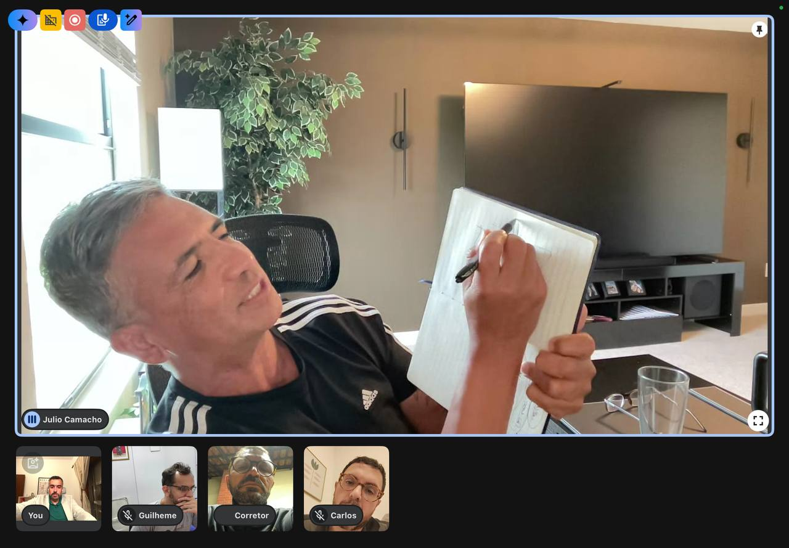
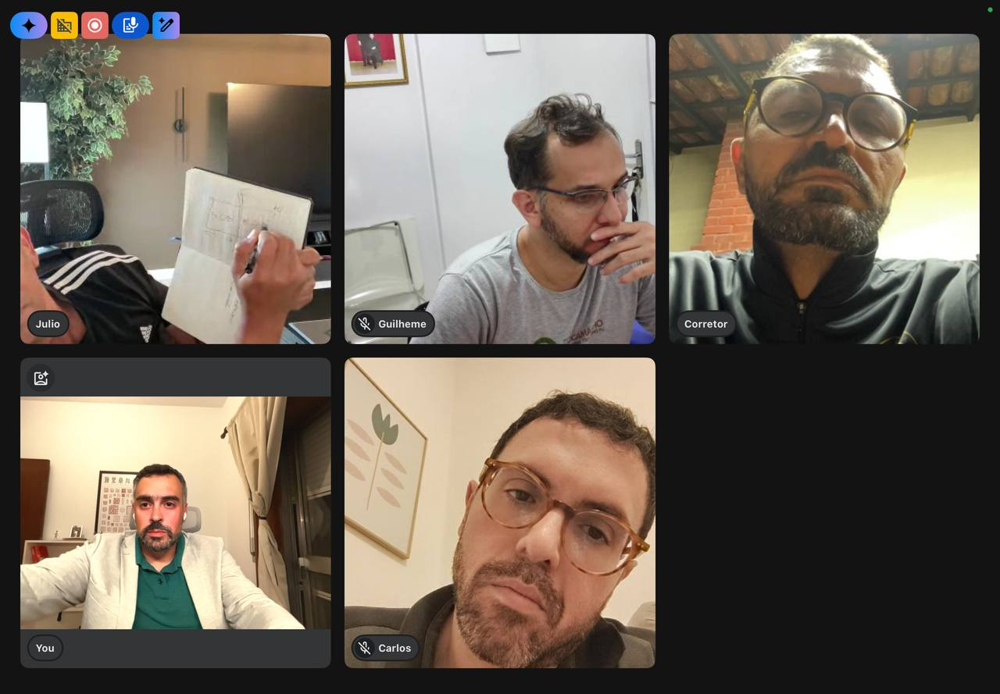

No quinto encontro do Programa de Mestrado estávamos o Mestre Márcio ([Moy Si Ou](https://scholion.thluiz.com/notes/moy-si-ou/)), o Mestre Antunes ([Moy Shan Si](https://scholion.thluiz.com/notes/moy-shan-si/)), o Mestre Guilherme ([Moy Faat Lin](https://scholion.thluiz.com/notes/moy-faat-lin/)), eu ([Moy Chi Yau Si](https://scholion.thluiz.com/notes/moy-chi-yau-si/)) e o [Si Fu](https://scholion.thluiz.com/notes/os-dois-si-fu/). A ideia da noite era avançar no capítulo do Sistema Ving Tsun, mas o Si Fu aproveitou para aprofundar sobre a estrutura do livro que cada um de nós está escrevendo.

### A arquitetura do livro

São nove capítulos, pensados para que os livros sejam comparáveis entre si. Introdução, três capítulos objetivos, três subjetivos, um sétimo com o título de cada autor, e a conclusão.

Os três objetivos são Kung Fu, Sistema e Sistema Ving Tsun. Têm definição, tradução, ideograma. O Si Fu insistiu que o capítulo do sistema Ving Tsun provavelmente é o mais extenso dos três: o mínimo é do tamanho do capítulo de Kung Fu, mas há material para muito mais. Basta pegar uma parte do Siu Nim Tau, dividir em três, e já se tem matéria para um capítulo inteiro.

Os três subjetivos são Vida Kung Fu, Família Kung Fu e Genealogia. Aqui cada um pode dizer uma coisa diferente, e o Si Fu vê isso como riqueza. Onde o sistema é tangível, a vida Kung Fu é subjetiva: o que foi de um jeito para mim pode ter sido outra coisa para você.

### Por que escrever

O Si Fu parou para uma pergunta: por que dividimos o mundo em pré-história e história? Porque num ponto passou a haver registro escrito. A escrita separa uma coisa da outra.

O ponto não era histórico. Registrar não é só deixar alguma coisa para trás. Escrever nos coloca em um modo de pensar que a fala não alcança. É mais difícil, exige outro critério, e é por isso que educa. Ninguém precisa virar escritor, mas vale entender a quase obsessão do nosso Kung Fu por esse tipo de registro. A ideia conversa com o que já anotei sobre [escrever como forma de não morrer](https://scholion.thluiz.com/notes/misatribuicao-escrever-forma-de-nao-morrer-saramago-vs-erico-verissimo/).

Deixar escrito, para uma família que se transmite de geração em geração, é uma das assinaturas do que somos.

### O capítulo do sistema

Depois da estrutura, cada um apresentou seu recorte do sistema, e o Si Fu foi pontuando.

O Mestre Márcio resumiu o Ving Tsun como um sistema corporal de combate simbólico, seis domínios transmitidos em três fases: estruturada, semiestruturada e não estruturada. Si Fu destacou uma palavra: independente. Márcio comentou que os domínios funcionam de forma independente; são interdependentes, conectados. O que caracteriza um sistema é a [interconexão das peças](https://scholion.thluiz.com/notes/ludwig-von-bertalanffy-teoria-geral-dos-sistemas/): a posição que se desenvolve no Siu Nim Tau é o que permite a variação do [Cham Kiu](https://scholion.thluiz.com/notes/cham-kiu-moy-yat-atravessar-a-ponte-curta/). Uma prepara a outra. No mesmo espírito, trocou "estático" por estacionário.

O Si Fu observou que na fala nos permitimos um descompromisso que a escrita cobra.

O Mestre Guilherme começou pela história e pelo nome do sistema. O Si Fu cortou: isso é genealogia, entra no capítulo próprio. No capítulo do sistema, o foco é o sistema. Sobre o nome, problematizou tomar "Ving Tsun" como o nome da fundadora. Para ele soa mais como nome de família ou nome iniciático, e deixou em aberto, lembrando que nunca tinha escutado dessa forma, o que não quer dizer que esteja errado.

Dois apontamentos extras para todos nós: "Domínio" e "território" são termos da família Moy Yat; as fases estruturada, semiestruturada e não estruturada vêm da família Moy Yat Sang. Não são universais do sistema. Podemos usar, desde que saibamos de onde vêm. E "sistema chinês", no nosso jargão, é o Hai Tong: um sistema baseado em lista em que a ordem dos elementos é essencial. Uma receita de bolo é uma lista onde a ordem dos ingredientes não importa; o Hai Tong é o oposto, trocar a ordem muda o sistema.

### Genealogia: crença e função

A genealogia foi o ponto mais delicado da noite. O Si Fu foi direto: ela é registro de crença e de função, não de verdade. Não temos como provar a linhagem. O que cada um consegue provar é que aprendeu aquela sequência do seu Si Fu, e que o Si Fu aprendeu do dele, e assim por diante.

Ele abriu o próprio nome para explicar. [Jo (祖)](https://scholion.thluiz.com/notes/etimologia-de-jo-zu/) é ancestral. [Lei (利)](https://scholion.thluiz.com/notes/etimologia-de-lei-li/) ele traduz por honrar, embora no dicionário o caractere apareça como vantagem, sagacidade, tenacidade. Honrar foi a tradução que recebeu de quem lhe deu o nome. E honrar os ancestrais, disse ele, não é só olhar para trás. Não existe ancestral absoluto: cada um é ancestral de quem vem depois. Gerar esse material, escrever esses livros, é uma forma de honrar para a frente.

Aí ele contou, pela primeira vez na família, a história do quadro com a sequência do Gwan que estava na parede do antigo núcleo Barra. Numa viagem a Nova York, por volta de 1990, escolheu uma pulseira de jade que agradou o Si Taai Gung. Em retribuição, ele lhe entregou um quadro, tomou de volta ao perceber que a ordem estava invertida, e deu outro, com a sequência correta.

Sobre o alcance, o Si Fu deu liberdade: cada um decide até onde pesquisa. A linhagem inteira, ou só as gerações com que teve contato direto, a partir do Si Gung.

### A liberdade do sétimo capítulo

O sétimo capítulo é o espaço de cada autor. Foi ali que o Mestre Antunes trouxe uma das observações criativas da noite, ao ler o sistema pelos pronomes: eu, tu, ele na parte física e intrapessoal; nós, vós, eles nas famílias, nas cerimônias, no público de fora. O Si Fu gostou e usou o exemplo para falar de liberdade.

O sétimo capítulo é onde se pode, inclusive, desdizer as separações que o próprio Si Fu propôs. A condição é ter entendido a proposta antes. Só se pensa diferente depois de escutar igual. Quem repete o que entrou faz uma cópia piorada. Para o Si Fu, processar o que se recebe e devolver algo próprio é o gesto mais respeitoso que existe.

Ele fez uma distinção fina sobre onde cabe essa autenticidade. Falando para discípulos de outros mestres, quanto mais diferente for a contribuição, melhor, porque não somos nós que formamos aquelas pessoas. Dentro da própria família, a responsabilidade é outra, porque o que se diz ali fica.

### O sistema como iniciação

Na minha vez, coloquei o Ving Tsun não como apenas um sistema corporal de combate simbólico. Seria um sistema iniciático de desenvolvimento de Kung Fu, estruturado a partir de uma família. O corpo é o caminho mais fácil para desenvolver [Kung Fu](https://scholion.thluiz.com/notes/kung-fu-tao-bom-ate-para-lutar/), não o único. Há quem não tenha o corpo como mecanismo. Se o sistema fosse só as listas, bastaria passar a lista, e não basta: sem a relação familiar, ninguém recebe a chave para lê-la. Por isso o sistema nasce quando o nome passa de um para outro, individualmente.

Daí a conversa foi parar na expressão "arte marcial". Fui atrás da origem do termo. O primeiro registro ocidental de [功夫](https://scholion.thluiz.com/notes/gong-fu-etimologia/) é de [Amiot](https://scholion.thluiz.com/notes/amiot-cong-fou-bonzes-tao-ssee/), jesuíta francês em Pequim, em 1779. Ele descreveu o Cong-Fou como ginástica médica taoísta, não como prática de combate. A confusão entre Kung Fu, ginástica e arte marcial começa aí. E não é ideia nova: o general Ming [Qi Jiguang](https://scholion.thluiz.com/notes/qi-jiguang-jixiao-xinshu/) já considerava, no século XVI, o combate desarmado inútil no campo de batalha, útil só para condicionar as tropas e construir confiança. "Marcial" vem de Marte, uma palavra de guerra, e descreve mal o que fazemos.

O que o Si Fu deixou naquela noite resume o porquê de tudo isso. Não é para vender, não é para ficar famoso. É para deixar. Livro roda mão, não se desfaz. Fica para alguém, vai para a frente.

Agora é escrever.
